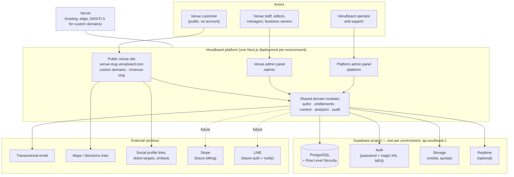
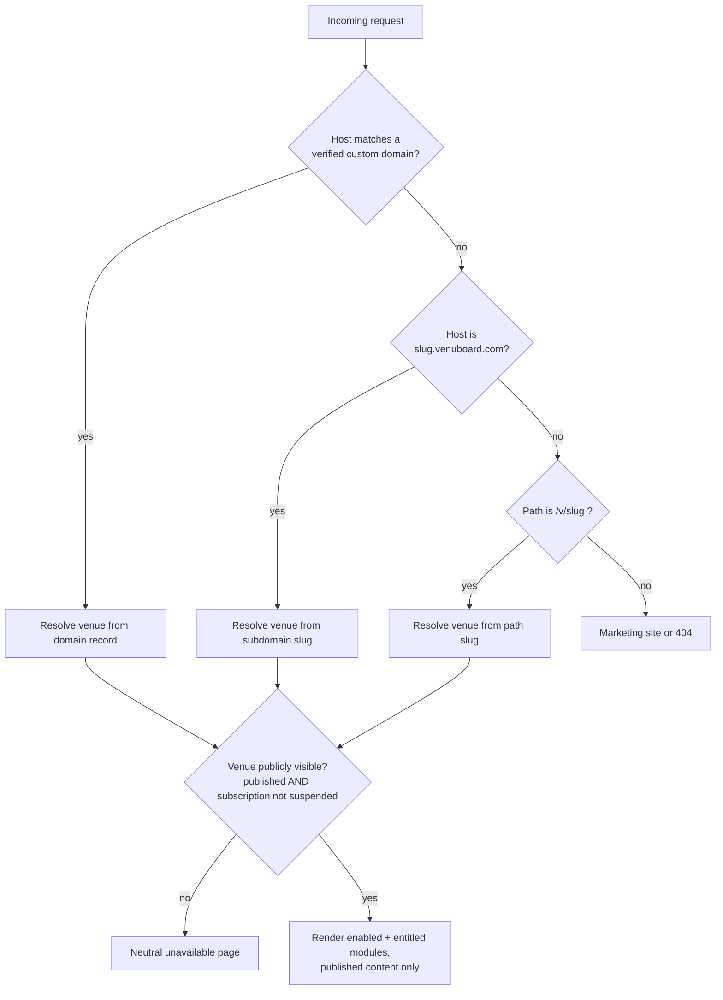
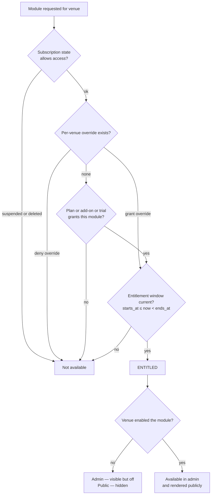

# VenuBoard — Architecture

**Status:** Accepted 2026-08-30 — nothing here blocks scaffolding · **Stage:** Foundation schema in repository · **Last updated:** 2026-08-31

This document describes the technical architecture. The foundation schema and RLS policies now exist in `supabase/migrations/`; product modules and the application `can()` layer are not built. Product scope is in [product-brief.md](./product-brief.md), the schema in [data-model.md](./data-model.md), authorisation in [roles-and-permissions.md](./roles-and-permissions.md), and the reasoning and unresolved questions in [decisions-and-open-questions.md](./decisions-and-open-questions.md).

The foundational decisions — shared multi-tenancy, modular monolith, Next.js and Supabase, defence-in-depth isolation, direct tenant keys, action-based permissions, the entitlement split, staff data separation and the no-custom-code boundary — were **accepted on 2026-08-30** (ADR-001 to ADR-010), along with migrations, testing, routing, support access, deactivation, bookings and content classification (ADR-012, ADR-017, ADR-020, ADR-022 to ADR-025) and the newer records ADR-028 to ADR-038. **No decision in this document is outstanding**; the records still marked proposed are non-blocking preferences ([decisions-and-open-questions.md](./decisions-and-open-questions.md#4-decisions-needed-before-application-scaffolding)).

Four things are **deliberately bounded rather than decided** ([ADR-038](./decisions-and-open-questions.md#adr-038--provisional-boundaries-for-the-four-non-blocking-feature-questions)) and are marked where they appear below: no production email integration in the initial scaffold, a system-font fallback until the approved font list exists, no database-changing preview deployments, and MFA represented architecturally with its enrolment and recovery flows still to be designed.

No package versions are pinned at this stage.

---

## 1. Architecture principles

1. **One shared multi-tenant platform.** One codebase, one deployment **per environment**, one PostgreSQL database per environment, many tenants. No per-venue deployment, database, schema or fork. This is a hard architectural rule, not a preference. Local, staging and production are separate, fully isolated environments — see [Environments](#17-environments-hosting-and-cicd).
2. **Modular monolith, not microservices.** Feature modules are separated by clear internal boundaries (own domain logic, own tables, own permission checks) but deploy as a single Next.js application.
3. **Defence in depth for tenant isolation.** PostgreSQL Row Level Security is the backstop; application-level authorisation is the primary gate. A bug in one must not by itself cause a cross-tenant leak.
4. **Server-authoritative.** All authorisation, entitlement resolution and tenant scoping happen on the server. The client is never trusted, and no client ever holds a credential that could read another tenant's data.
5. **Structured content, no code injection.** Venues supply data and choose from approved presentation options. No custom CSS, no custom JavaScript, no raw HTML. This is what makes a single rendering pipeline safe and fast.
6. **Entitlement is the gate; venue configuration is the switch.** Both are evaluated server-side on every request that could expose a module.
7. **Boring, well-supported technology.** A small team must be able to operate this. Managed services over self-hosted infrastructure wherever reasonable.
8. **Auditable by construction.** Security-relevant writes and all platform-operator activity inside a tenant produce audit records.

## 2. System context



Dashed edges are planned future integrations, not MVP.

## 3. Proposed technical stack

| Concern                  | Choice                                                                                   | Notes                                                                                                                                                                                |
| ------------------------ | ---------------------------------------------------------------------------------------- | ------------------------------------------------------------------------------------------------------------------------------------------------------------------------------------ |
| Package manager          | **npm** (current, not locked)                                                            | Used for the initial scaffold and `package-lock.json`. Revisit if a different installer is preferred; this is not an accepted ADR                                                    |
| Framework                | **Next.js, App Router**                                                                  | Server Components for public pages and admin data loading; Server Actions or route handlers for writes                                                                               |
| Language                 | **TypeScript, strict mode**                                                              | `strict: true`, no implicit `any`; `any` and `Function` types disallowed                                                                                                             |
| UI                       | **React**, **Tailwind CSS**, **shadcn/ui**                                               | shadcn/ui components are vendored into the repo and themed per venue via CSS custom properties                                                                                       |
| Database                 | **PostgreSQL**                                                                           | One database per environment, single logical schema set, RLS on every tenant table. **No enum types** — text + `CHECK` for workflow states, reference tables for commercial concepts |
| Platform services        | **Supabase**                                                                             | Managed PostgreSQL, authentication, storage, realtime, Row Level Security. One project per environment, region **`ap-southeast-1` (AWS Singapore)**                                  |
| Migrations               | **SQL migrations stored in the repository**                                              | Forward-only, reviewed, applied through CI to every environment in the same order; RLS policies, `CHECK` constraints, reference-table contents and grants are part of migrations     |
| Auth (MVP)               | **Supabase email authentication — password _and_ magic link**                            | Both methods available; the user chooses per sign-in. **MFA supported architecturally, mandatory for platform accounts before production launch**                                    |
| Onboarding               | **Invitation-based**, operator-led                                                       | Tokenised, expiring invitations tied to a target business/venue and role. **No public self-service signup in the MVP**                                                               |
| i18n                     | **next-intl** for interface strings; **normalised translation tables** for venue content | English and Thai; locale-aware routing on the public site                                                                                                                            |
| Validation               | **Zod**                                                                                  | One schema per input boundary, reused for types and runtime validation                                                                                                               |
| Forms                    | **React Hook Form**                                                                      | Used for complex forms; simple forms may use plain Server Actions                                                                                                                    |
| Unit / integration tests | **Vitest**                                                                               | Domain logic, permission resolution, entitlement resolution, Zod schemas                                                                                                             |
| End-to-end tests         | **Playwright**                                                                           | Public site, admin panel, platform panel, onboarding flow                                                                                                                            |
| Security tests           | **Automated tenant-isolation and permission tests**                                      | First-class, non-optional suite — see [Testing strategy](#16-testing-strategy)                                                                                                       |
| Test data                | **Deterministic seed dataset + fixed test identities**                                   | Shared by local development, staging and the automated suites — see [Seed data](#171-seed-data-and-the-reset-workflow)                                                               |
| Hosting                  | **Vercel** (proposed initial)                                                            | Separate deployments per environment; preview deployments must never hold production credentials                                                                                     |
| Custom domains           | **Manual configuration for MVP**, automated later                                        | Operator adds the domain in `/platform` and in the hosting provider                                                                                                                  |
| Billing                  | **Stripe, future**                                                                       | Not required for the first scaffold; manual billing state in MVP                                                                                                                     |

## 4. Application structure (modular monolith)

Proposed top-level layout. Boundaries matter more than exact folder names.

```
app/
  (public)/                 # public venue site, tenant resolved from host or /v/[slug]
    v/[venueSlug]/
  admin/                    # venue administration panel
  platform/                 # platform administration panel
  api/                      # route handlers (webhooks, uploads, analytics ingest)
src/
  modules/                  # feature modules — the seams of the monolith
    venue-profile/
    staff-presence/
    feed/
    events/
    bookings/
    atmosphere/
    offers/
    social-links/
    analytics/
    entitlements/
    billing-state/
    support-sessions/
    moderation/             # platform quarantine, takedown and restore + moderation audit
  core/
    auth/                   # session, identity, membership loading, MFA
    authz/                  # action catalogue, policy evaluation
    tenancy/                # tenant context resolution and propagation
    db/                     # typed clients, RLS-aware access helpers
    audit/                  # audit writer
    env/                    # explicit environment identifier + production guards
    i18n/                   # locale resolution, translation-table access, fallback chain
    validation/             # shared Zod primitives
  ui/                       # shadcn/ui components + venue theming primitives
supabase/
  migrations/               # forward-only SQL: tables, RLS, CHECK constraints, reference data
  seed/                     # deterministic development + staging seed data (fictional only)
scripts/
  db-reset.mts              # refuses to run when the environment is production
  db-seed.mts               # notice only; reset applies seed
  db-perf-seed.mts          # local-only volume fixture
  db-types-check.mts        # generated types must match committed file
tests/
  unit/  integration/  e2e/  isolation/  permissions/  moderation/
docs/
```

Module rules:

- A module owns its tables, its Zod schemas, its permission checks and its UI.
- Cross-module access goes through a module's exported functions, never by reaching into another module's tables directly.
- Every module declares a **module key** (`core_profile`, `staff_presence`, `feed`, `events`, `booking_requests`, `atmosphere`, `offers`, `social_links`) used consistently by entitlements, venue settings, navigation and analytics.
- Extracting a module into a separate service later must remain possible, but is not a goal.

## 5. Surfaces, routing and tenant resolution

### 5.1 Public site

Resolution order for an incoming public request:



- The request proxy (`src/proxy.ts`) currently negotiates the interface locale only. Tenant resolution from the host (or the `/v/[slug]` fallback in local development and as a permanent fallback route) will also live there later (ADR-020); it is not implemented in this scaffold.
- The public site never receives an authenticated tenant session and never queries with an authenticated user's privileges.
- Every venue always has a `venuboard.com` subdomain; a custom domain is additive and requires operator verification.

### 5.2 `/admin`

- Requires an authenticated user with at least one active membership.
- Sign-in accepts **either an email and password or an email magic link**; both paths land in the same session handling.
- The user selects an **active business** and **active venue**; the selection is stored server-side in the session and validated against memberships on every request.
- Navigation is generated from `(entitled modules) ∩ (enabled modules) ∩ (actions the user may perform)`.
- Because each venue carries its own subscription, the venue switcher also surfaces per-venue trial and billing state, and a business owner gets a combined overview across their venues.

### 5.3 `/platform`

- Requires an authenticated user holding a **platform role**. Platform roles live in a separate table from business/venue memberships and are never granted by tenant users.
- **MFA is mandatory for `platform_admin` and `platform_support` accounts before production launch**, and **MFA is represented in the architecture and the schema from the first build** (`users.mfa_enrolled_at`, an enforcement check on the platform sign-in path). Enrolment and recovery mechanics remain a **pre-production security decision** (OQ-40), so the first scaffold carries the representation without a half-designed recovery flow ([ADR-038](./decisions-and-open-questions.md#adr-038--provisional-boundaries-for-the-four-non-blocking-feature-questions)).
- Additional protections: IP/allow-list consideration, and every read of tenant data inside an active support session is audited where practical.
- `/platform` also owns **tenant creation**: because there is no public self-service signup, this is the only route by which a business, its first owner and its venues come into existence, so it must be a genuinely good flow rather than an internal afterthought.
- `/platform` owns the **moderation surface** too: `platform_admin` may quarantine or unpublish public content without opening a support session, under the stricter conditions in [section 15.1](#151-content-moderation-enforcement). `platform_support` does not hold that action.

## 6. Request lifecycle and authorisation

Every server-side entry point (Server Component data load, Server Action, route handler) follows the same sequence:

1. **Resolve identity** — Supabase session, or "anonymous public visitor".
2. **Resolve tenant context** — active business/venue for `/admin`; venue from host/slug for public; explicitly selected tenant for `/platform` (only inside a support session for tenant-scoped data).
3. **Validate input** with Zod at the boundary.
4. **Check the action** against the permissions matrix in [roles-and-permissions.md](./roles-and-permissions.md) — a named action plus a scope (business or venue), never a role-name string comparison.
5. **Check the entitlement** if the action touches a module.
6. **Execute** against PostgreSQL. RLS, constraints and triggers are the **final security boundary** for direct Data API access — they must deny even if `can()` was skipped or wrong.
7. **Audit** if the action is security-relevant.
8. **Invalidate caches** for the affected venue.

Authorisation is expressed as a single primitive:

```
can(actor, action, scope) -> boolean
```

Implemented once in `core/authz`, used by UI rendering, Server Actions and tests. There is no second, divergent copy of the rules. **`can()` is fail-early UX.** Isolation, private data, entitlements, platform authority, moderation quarantine, deactivation and privilege escalation are enforced in the database; see [conditional-permission-enforcement.md](./security/conditional-permission-enforcement.md).

## 7. Tenant isolation

Tenant isolation is treated as the platform's most critical security property.

### 7.1 Rules

- Every tenant-owned table carries a **direct tenant key**: `venue_id` for venue-scoped data, `business_id` for business-scoped data. Isolation is never inferred through a multi-table join chain.
- **RLS is enabled and forced on every tenant table.** No table is exempt. A migration that adds a tenant table without policies must fail review and, where possible, fail an automated check.
- Application code never uses the Supabase **service-role key** in a request path that serves tenant users. Service-role usage is confined to explicitly reviewed background/administrative operations.
- Public reads use a dedicated **restricted read path** whose policies only expose published content from entitled and enabled modules for venues that are publicly visible.
- Cross-tenant operations (for example copying an event between venues) are implemented as an explicit server operation that authorises the actor **separately for the source and the destination venue**.

### 7.2 Enforcement layers

| Layer                               | Enforces                                                                            |
| ----------------------------------- | ----------------------------------------------------------------------------------- |
| Request proxy / tenant context      | Which venue this request may talk about at all (locale only in this scaffold)       |
| Application authorisation (`can()`) | Fail-early UX: whether this actor may perform this action in this scope             |
| Entitlement resolution              | Whether this module exists for this venue                                           |
| PostgreSQL RLS, constraints, triggers | Final boundary: rows and writes outside the actor's rights are denied even if the query or UI is wrong |
| Storage policies                    | Media paths are venue-prefixed and access-controlled                                |
| Audit log                           | Detection and forensics after the fact                                              |

### 7.3 RLS approach

- Membership is resolved in SQL through `SECURITY DEFINER` helper functions (for example `auth_venue_ids()`, `auth_business_ids()`, `auth_has_action(action, venue_id)`) that are cheap, stable within a statement, and indexed on the membership tables.
- Policies are written per operation (`SELECT`, `INSERT`, `UPDATE`, `DELETE`) rather than one permissive `FOR ALL` policy.
- Public visibility is expressed by explicit `SELECT` policies for the anonymous role, gated on content state, module enablement, entitlement validity and venue publication state.
- **Translation tables get the same treatment as their parents.** A `*_translations` row is publicly readable only if the parent row is, so its policy tests the parent's visibility rather than only matching `venue_id`.
- **The duplicated tenant key is protected by database constraints, not by careful code.** Every child table that carries its parent's `venue_id` is joined to the parent by a **composite foreign key** `(parent_id, venue_id)` → `(id, venue_id)`, so a child row cannot claim a venue its parent does not have. This is what makes a policy that only checks `venue_id` safe. See [ADR-037](./decisions-and-open-questions.md#adr-037--duplicated-tenant-keys-are-protected-by-composite-foreign-keys) and [data-model.md](./data-model.md#111-tenant-key-integrity-constraints); the isolation suite must attempt cross-venue mismatches and assert rejection.
- **Performance is measured early, not eventually.** Ordinary reset stays small. A separate local fixture (`npm run db:perf:seed` / `npm run db:perf`) loads enough tenant-scoped rows for the planner to make index choices, then records plans in [docs/performance/foundation-rls-baseline.md](./performance/foundation-rls-baseline.md). CI does not load that fixture. This is an obligation on the first implementation rather than a gate on starting it (OQ-30 in [decisions-and-open-questions.md](./decisions-and-open-questions.md#33-technical)).

## 8. Module entitlement resolution



- Resolution is a **pure server-side function** over **that venue's own subscription**, plan, add-ons, trials and overrides. Subscriptions are venue-scoped, so a sibling venue's state never influences the answer. It is unit-tested exhaustively.
- The result is cached per venue with explicit invalidation on any entitlement or setting change.
- Precedence: **per-venue override → trial → add-on → plan**, with an explicit deny override always winning. Precedence values live in the `entitlement_sources` reference table rather than being hard-coded.
- A **standard 30-day trial grants every MVP module**, so a venue in trial resolves as entitled for all of them unless the operator configured exclusions. Trial expiry therefore removes several modules at once, which the pre-expiry warnings and the seed dataset must both cover.
- `core_profile` is always entitled; it cannot be revoked while the venue exists.
- **Restricted** and **past due** states limit administrative writes but keep the public site up; **suspended** takes the public site down. See [product-brief.md](./product-brief.md#13-subscription-lifecycle).

## 9. Data and migrations

- **All schema changes are SQL migrations in the repository**, forward-only, one logical change per file, named with a timestamp prefix.
- RLS policies, grants, `CHECK` constraints, unique keys, composite foreign keys and reference-table contents live in migrations alongside table definitions — never applied by hand in the Supabase dashboard.
- **A tenant-keyed child table and its composite foreign key ship in the same migration.** Adding the constraint later means a migration against live data with existing violations to clean up, so it is treated as part of the table definition rather than a follow-up ([ADR-037](./decisions-and-open-questions.md#adr-037--duplicated-tenant-keys-are-protected-by-composite-foreign-keys)). Because integrity constraints are what protect the duplicated tenant key, **migration review is security review**.
- **No PostgreSQL enum types.** Stable internal workflow states are `text` columns with `CHECK` constraints; configurable commercial concepts (modules, plans, entitlement definitions) are reference tables. Adding a state is an `ALTER` of one constraint rather than an enum-type mutation with dependency fallout.
- Migrations are applied to **every environment in the same order** — local, then staging, then production — never selectively.
- Migrations run in CI against an ephemeral database, followed by the tenant-isolation test suite, before any deployment.
- Database types are generated from the schema and committed, so TypeScript and SQL cannot silently diverge. Because vocabularies are `CHECK` constraints rather than enum types, a test asserts that the generated TypeScript unions and the database constraints agree in both directions.
- Soft deletion (`deactivated_at` / `archived_at`) is the default; hard deletion is reserved for retention-policy execution and legally required erasure.

## 10. Media and storage

- Supabase Storage, one bucket layout keyed by tenant: `venues/{venue_id}/{module}/{asset_id}`. Buckets belong to a single environment; nothing is shared between local, staging and production.
- Upload flow: authorise action → check **storage quota** → validate MIME type, dimensions and size → store → record a `media_asset` row with byte size → recompute venue usage.
- Quota behaviour: warn near the limit, **block new uploads** past it, never auto-delete existing content.
- Images are transformed to responsive variants; the public site serves modern formats with explicit dimensions to protect mobile performance.
- Video in MVP is limited (short clips, size-capped). Whether video is stored directly or delegated to an external provider is OPEN.
- Uploaded media is a moderation surface: a platform administrator can quarantine an asset for policy violations via `moderate_content`. A quarantined asset is never served publicly, cannot be re-attached to published content, and cannot be released by the venue — see [section 15.1](#151-content-moderation-enforcement).

## 11. Internationalisation

- `next-intl` with locales `en` and `th`. **Interface strings** live in message catalogues in the repository.
- **Venue-authored content lives in normalised, entity-specific translation tables** — `venue_translations`, `post_translations`, `event_translations`, `offer_translations` and one per other translatable entity — each row keyed by its parent and a locale. Locale-keyed JSON columns and a single generic polymorphic translations table are both rejected. See [data-model.md](./data-model.md#12-multilingual-content).
- Reads join the parent to its translation for the requested locale, with a fallback chain of **requested locale → venue default locale → any available locale**. The public site never shows an empty field because a translation is missing, and it marks untranslated content honestly rather than machine-translating silently.
- Writes are transactional: creating or editing content writes the parent row and its translation rows together, so a published post can never exist with no readable text.
- Because translations are rows rather than JSON, **translation coverage is queryable** — the admin panel can list published content missing a Thai version, which is the practical reason this shape was chosen.
- Dates, times and opening hours are rendered in the **venue's timezone**, which is stored on the venue.
- Thai typography (line height, font fallbacks, no forced uppercase) is handled in the shared UI layer; the approved font list must include fonts with Thai coverage. **The list itself is undecided (OQ-27), so the initial scaffold uses a minimal system-font stack** and builds the `font_key` field and the approved-list mechanism around it ([ADR-038](./decisions-and-open-questions.md#adr-038--provisional-boundaries-for-the-four-non-blocking-feature-questions)). Adding the real fonts later is a data change, not a refactor.

## 12. Public site rendering and performance

- Public pages are server-rendered and aggressively cached per venue, with **tag-based invalidation** on publish, unpublish, presence toggle, atmosphere update and branding change.
- Presence and atmosphere are the most time-sensitive data; they use short cache lifetimes (and optionally Supabase Realtime for live updates — optional, not required for MVP).
- Branding is applied through CSS custom properties derived from the venue's stored palette and approved font selection. No venue-supplied stylesheet is ever loaded.
- A contrast check is applied to venue-chosen colour combinations so branding cannot produce an unreadable or inaccessible site.
- Performance budget is mobile-first, assuming a mid-range Android phone on a mobile network (specific budget targets OPEN).

## 13. Analytics pipeline

- First-party only. Public interactions post lightweight events to an internal ingest route; the client never writes to the database directly.
- Events are stored append-only with `venue_id`, event type, timestamp and coarse context. **No cross-site tracking, no third-party advertising pixels.**
- Aggregation into daily per-venue rollups powers admin dashboards; raw events have a shorter retention than rollups (durations OPEN).
- Bot filtering and de-duplication happen at ingest.
- Staff-profile view metrics are only collected for staff who have consented to public display, and are reported in aggregate.
- Cookie/consent requirements under Thai PDPA and EU GDPR must be confirmed before launch (OPEN).

## 14. Notifications

- An internal notification service writes in-app notifications and dispatches email through a **provider-agnostic transport interface**. The production provider is undecided (OQ-18), and **no production email integration is required in the initial scaffold**: local and CI use a mail catcher or a logged transport, so invitations and magic links are developable and testable without a live provider ([ADR-038](./decisions-and-open-questions.md#adr-038--provisional-boundaries-for-the-four-non-blocking-feature-questions)). Choosing the provider later is a configuration change behind that interface.
- Per-user and per-venue preferences are consulted before dispatch; **defaults are conservative and never fan out to all channels**.
- Delivery is queued and retried; a failed email never blocks the originating transaction.
- LINE messaging is a later channel and must not be assumed in MVP design.

## 15. Support access enforcement (technical)

The policy is defined in [roles-and-permissions.md](./roles-and-permissions.md#7-platform-support-and-impersonation). Technically:

- A support session is a **row** (`support_sessions`) with target tenant, operator identity, stated reason, mode (`read_only` | `write`), expiry and ticket reference.
- The session, not the platform role alone, is what grants access to tenant data. No open session means no tenant-data access.
- Write mode requires a **separate, explicit confirmation**, is **time-limited**, and is **scoped** to the target venue or business.
- Sessions never expose passwords, password hashes, session tokens, **magic-link or password-reset tokens**, or MFA factors and recovery codes; there is no "log in as" that borrows the user's credentials. The operator acts as themselves with an attached support context, and the audit trail records both identities.
- Every session start and end, the impersonated identity, the reason, every write, and reads where practical are written to the audit log.
- A persistent, high-visibility banner is rendered whenever a support session is active, in both `/platform` and any tenant view.
- Support access does **not** silently bypass tenant boundaries: the session grants scoped access explicitly and visibly rather than disabling isolation.

### 15.1 Content moderation enforcement

`moderate_content` ([ADR-036](./decisions-and-open-questions.md#adr-036--moderate_content-as-a-platform-action)) is the single platform capability over tenant records that does **not** require a support session, because it can only remove public content and never reads private data or authors anything. Its rules are in [roles-and-permissions.md](./roles-and-permissions.md#41-moderate_content-rules); technically:

- Every publishable entity carries `platform_quarantined_at`, `platform_quarantine_reason` and `platform_quarantined_by`. These columns are **platform-write-only**, in the same way entitlements are: no tenant-facing policy grants write access to them.
- **The republication block lives in the database.** A `CHECK` constraint makes a publicly visible state impossible while `platform_quarantined_at` is set, so a venue pressing "publish" again — or unarchiving, or rescheduling — is rejected by PostgreSQL rather than merely hidden by the interface. A quarantine that the venue can work around would be worse than none, so this cannot be application-only.
- **A reason is structurally required**: the same constraint requires `platform_quarantine_reason` whenever the quarantine timestamp is set.
- Quarantine **hides and preserves**. Rows, translations and media survive so the operator can answer a dispute or a legal request; deletion happens only where legally required, through the retention path.
- Every quarantine, unpublish and **restore** writes a `moderation_actions` row — acting platform user, venue, resource, previous state, resulting state, reason, timestamp — linked to its `audit_log` entry, so moderation is separately queryable and distinguishable from ordinary support activity. See [data-model.md](./data-model.md#69-platform-moderation-and-quarantine).
- `platform_support` does not hold this action. Cache invalidation for the affected venue is part of the moderation write path, so quarantined content leaves the public site immediately rather than at the next revalidation.

## 16. Testing strategy

| Layer                      | Tool                          | Focus                                                                                                                                                                                                                                                                                                                                                                                                                |
| -------------------------- | ----------------------------- | -------------------------------------------------------------------------------------------------------------------------------------------------------------------------------------------------------------------------------------------------------------------------------------------------------------------------------------------------------------------------------------------------------------------- |
| Unit                       | Vitest                        | Permission resolution, entitlement resolution, state machines, Zod schemas, quota maths, translation fallback chain                                                                                                                                                                                                                                                                                                  |
| Integration                | Vitest + ephemeral PostgreSQL | Migrations, RLS policies, `CHECK` constraints, repository functions, real SQL behaviour                                                                                                                                                                                                                                                                                                                              |
| **Tenant isolation**       | pgTAP (`npm run db:test`) + later Vitest | Foundation tables: denied RLS behaviour and rejected composite-key mismatches in `supabase/tests/`. Vitest suite in `tests/isolation` remains for remaining modules once they exist. |
| **Permissions**            | pgTAP (`npm run db:test`) + later Vitest | Catalogue of 33 actions, C1–C19 foundation enforcement, and helper results for seed identities. Application `can()` matrix coverage still belongs in `tests/permissions` once that layer exists; it must not replace SQL tests. |
| **Vocabulary consistency** | Vitest                        | Generated TypeScript unions and Zod schemas match the database `CHECK` constraints in both directions                                                                                                                                                                                                                                                                                                                |
| **Moderation**             | Vitest + Playwright           | `moderate_content` is refused without a reason and refused to `platform_support`; quarantine removes content from the public site; a **venue cannot republish a quarantined record**; restore is audited like a takedown                                                                                                                                                                                             |
| End-to-end                 | Playwright                    | Both sign-in methods, operator-led tenant creation, publish flow, booking request lifecycle, presence toggle, support session banner and audit, platform entitlement changes, trial expiry                                                                                                                                                                                                                           |
| Accessibility / perf       | Playwright + audits           | Public site on a mobile viewport, contrast of venue palettes                                                                                                                                                                                                                                                                                                                                                         |

All suites run against the **deterministic seed dataset and fixed test identities** described in [section 17.1](#171-seed-data-and-the-reset-workflow), so a matrix cell maps to a real login against known data rather than to bespoke setup code.

Non-negotiable rules:

- A new tenant table — including a translation table — without isolation tests does not merge.
- A tenant-keyed child table without its composite foreign key and a rejected-mismatch test does not merge.
- A new action without matrix coverage does not merge.
- A new controlled vocabulary value without a constraint and a consistency test does not merge.
- Isolation and permission suites run on every pull request, not nightly.
- Tests never run against production, and no test fixture is ever derived from production data.

## 17. Environments, hosting and CI/CD

**Three completely separate environments**, with nothing shared between them ([ADR-034](./decisions-and-open-questions.md#adr-034--three-fully-isolated-environments-local-staging-production)).

| Environment    | Application                  | Supabase                          | Data                                       |
| -------------- | ---------------------------- | --------------------------------- | ------------------------------------------ |
| **Local**      | Developer machine            | Local Supabase stack              | Resettable deterministic seed data         |
| **Staging**    | Dedicated staging deployment | Dedicated hosted Supabase project | Seed data only — **never production data** |
| **Production** | Production deployment        | Its own Supabase project          | Real customer data                         |

Isolation rules:

- **Authentication users, databases, storage buckets, secrets and external-service configuration are isolated per environment.** No Supabase project, bucket, API key, email domain or third-party account is shared. A staging invitation email can never reach a production customer.
- **Production customer data is never copied into staging or local**, in whole or in part. Realistic testing comes from the seed dataset instead, which is precisely why that dataset must be good.
- **The environment identifier is explicit** — a required configuration value (`local` | `staging` | `production`), validated at boot, recorded on audit entries, and displayed as a persistent banner in every non-production environment so nobody mistakes staging for production.
- **Destructive commands refuse to run in production.** Reset, re-seed, truncate and bulk-fixture scripts check the environment identifier at runtime and exit with an error if it is `production`. This is a runtime guard, not a naming convention or a code comment.
- **A permanent staging environment is required before production launch**, not spun up on demand.
- **Pull-request preview deployments must never receive production credentials**, and **database-changing previews are not enabled** until an isolated preview-data strategy is accepted. Which database they would target — the staging project or an ephemeral per-branch database — is undecided (OQ-38), so read-only or build-only previews are the boundary for now ([ADR-038](./decisions-and-open-questions.md#adr-038--provisional-boundaries-for-the-four-non-blocking-feature-questions)).
- CI creates **ephemeral databases** for the integration, isolation and permission suites. These are local-class: built from migrations, filled from the same deterministic seed dataset, destroyed afterwards, and never given production credentials.

Other operational points:

- **Hosting:** Vercel proposed for the application; Supabase for data, auth and storage, in **`ap-southeast-1` (AWS Singapore)** for good Thailand latency. That region choice fixes where primary data lives; **it does not by itself establish PDPA compliance** (OQ-04).
- **Staging hostnames** must be visibly distinct from production, so a staging venue site can never be mistaken for a customer's live site or indexed by search engines.
- **CI:** typecheck → lint → unit → migrations on ephemeral database → integration → isolation, permission and vocabulary suites → Playwright → build. Deployment is blocked on all of it. Migrations reach staging before production, always in the same order.
- **Custom domains (MVP):** manual. The operator records the domain in `/platform`, the customer points DNS, the operator adds it to the hosting provider, TLS is issued by the provider, and the domain is marked verified. Automation via the hosting provider's API is a later improvement.
- **Secrets** live in each environment's own configuration; nothing tenant-identifying or secret is committed, and no secret is reused across environments.
- **Backups:** managed PostgreSQL point-in-time recovery, with a documented and _actually rehearsed_ restore procedure (cadence undecided — OQ-26). Restores are rehearsed into a scratch environment, **never by copying production data into staging**.

### 17.1 Seed data and the reset workflow

The scaffold must include a **safe reset-and-seed workflow for local and staging** ([ADR-035](./decisions-and-open-questions.md#adr-035--deterministic-repeatable-seed-data-and-fixed-test-identities)).

- **Deterministic:** fixed UUIDs and timestamps relative to a seed epoch, so repeated runs produce identical databases and tests can assert on known rows.
- **Repeatable and idempotent:** `db:reset` drops and rebuilds from migrations, then seeds; `db:seed` alone is safe to re-run.
- **Guarded:** both refuse to run when the environment identifier is `production`, checked before any statement executes.
- **Fictional only:** all names, images, email addresses and contact details are invented, and must not resemble real venues in the target cities (OQ-37). Genuine customer or staff information never appears.
- **Comprehensive:** the dataset covers every role, subscription and trial state, quota boundary, content workflow state, translation-coverage combination, staff lifecycle transition, support session and deliberate permission-denied scenario. The full coverage list is in [data-model.md](./data-model.md#14-seed-data-for-local-and-staging).
- **Fixed test identities:** one account per role, referenced by name from the permission and isolation suites. Their credentials come from **environment variables or secure test configuration and are never committed**.
- Reference data (`modules`, `plans`, `plan_modules`, `entitlement_sources`) is **not** seed data — it ships in migrations, so production gets it without any demo content.

## 18. Observability and security posture

- Structured server logs with request ID, actor ID, tenant ID, action name **and environment**; never log personal data or secrets.
- Error tracking and uptime monitoring on all three surfaces, with public-site availability watched per custom domain, configured separately per environment so staging noise never masks a production incident (tooling choice undecided — OQ-25).
- Rate limiting on public write endpoints — booking requests, analytics ingest, authentication (both password and magic-link requests) and invitation acceptance — to blunt spam and abuse.
- Magic-link tokens and password reset tokens are authentication secrets: never logged, never rendered in support views, never exposed by a support session.
- Standard hardening: strict Content Security Policy (made possible by banning custom scripts), signed and expiring media URLs where content is not fully public, CSRF protection on Server Actions, input validation at every boundary, and least-privilege database roles.
- Audit log is append-only, tamper-evident, and readable by platform administrators; a business owner can see audit entries for their own tenants (scope of tenant-visible audit is OPEN).

## 19. Scaling path and known limits

The design intentionally accepts these limits for MVP and documents the escape hatches:

| Limit                                            | MVP position                                                                       | Escape hatch                                                                                                                              |
| ------------------------------------------------ | ---------------------------------------------------------------------------------- | ----------------------------------------------------------------------------------------------------------------------------------------- |
| Single database per environment                  | Fine for hundreds of venues                                                        | Read replicas, then per-region sharding by business if ever needed                                                                        |
| Single deployment per environment                | Fine; surfaces scale together                                                      | Route-level splitting is possible without a domain-model change                                                                           |
| Manual custom domains                            | Acceptable at low volume; operator toil                                            | Provider API automation                                                                                                                   |
| Manual billing state, one subscription per venue | Acceptable for the first cohort; bookkeeping grows with venue count                | Stripe integration mapping plans to entitlements, then invoice consolidation per business (OQ-39)                                         |
| Operator-led onboarding only                     | Acceptable while the cohort is sold to in person                                   | Add a public self-service signup path once billing is automated                                                                           |
| One join per translatable entity per locale      | Negligible at MVP volume                                                           | Cache resolved public pages per venue and locale, which the rendering layer already does                                                  |
| Moderation is a manual platform action           | No report queue, no moderator role; `platform_admin` acts on what it is told about | Add a reports inbox and a dedicated moderator role once volume demands it — the audited action and the quarantine mechanism already exist |
| Analytics in PostgreSQL                          | Fine at MVP event volume                                                           | Move raw events to an analytics store, keep rollups                                                                                       |
| No recurrence engine for events                  | Manual duplication                                                                 | Add a recurrence rule model without changing the event table's meaning                                                                    |

## 20. Explicitly out of architectural scope

Microservices, per-tenant deployments or databases, native mobile applications, a plugin system executing tenant-supplied code, arbitrary CSS or JavaScript injection, POS or payment-terminal integration, real-time inventory, and a public self-service signup path. See [product-brief.md](./product-brief.md#17-non-goals-for-the-first-release).
