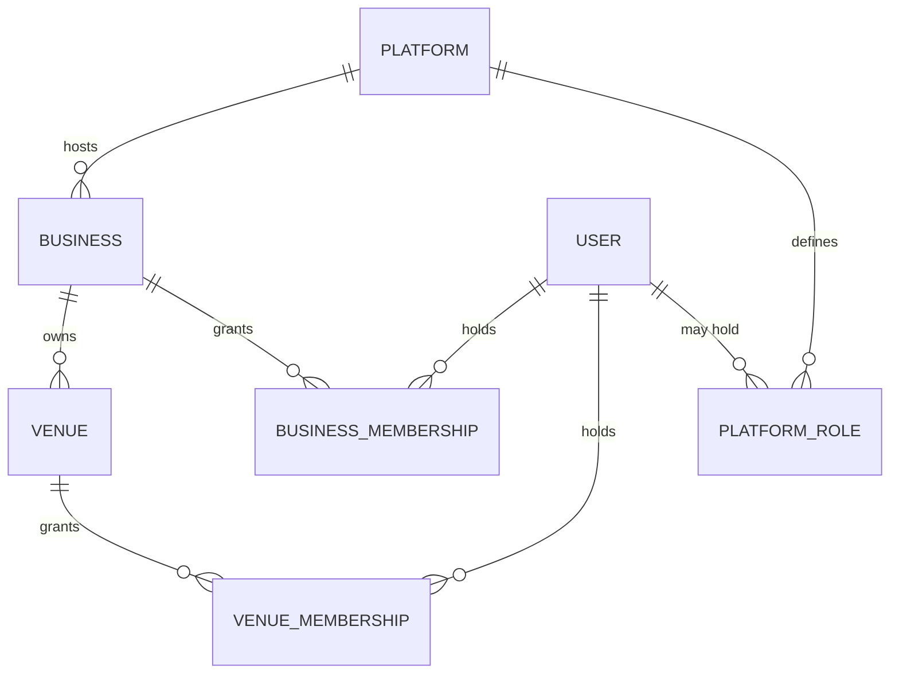
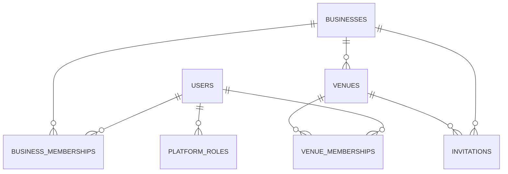
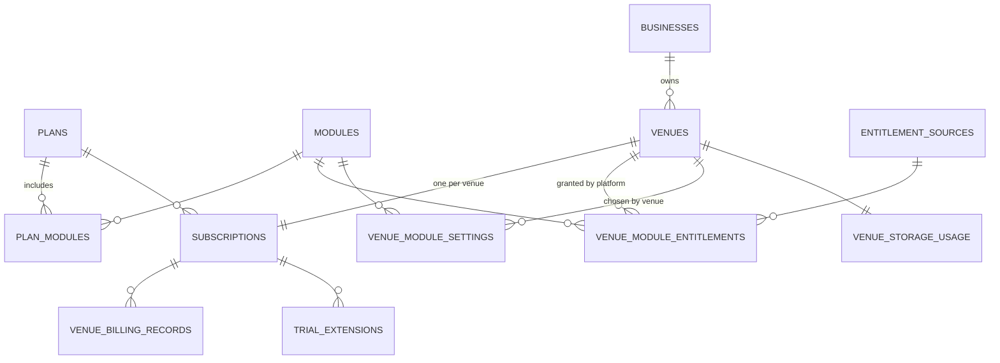
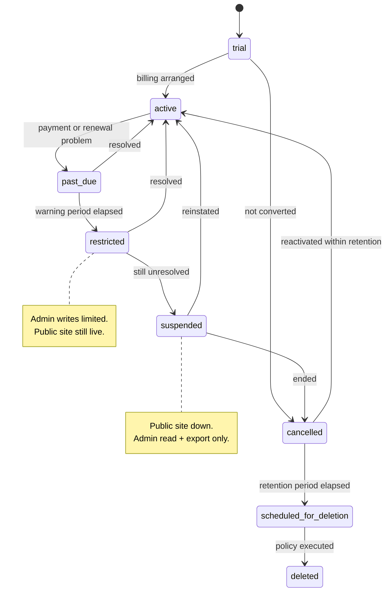
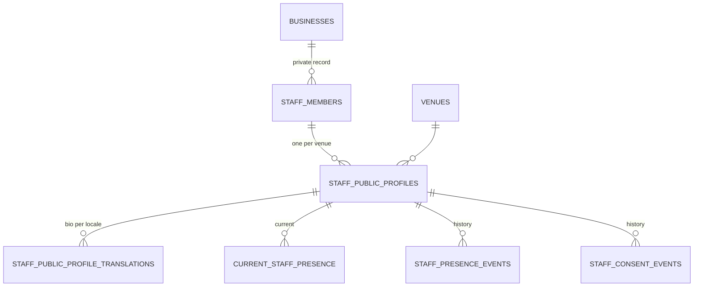
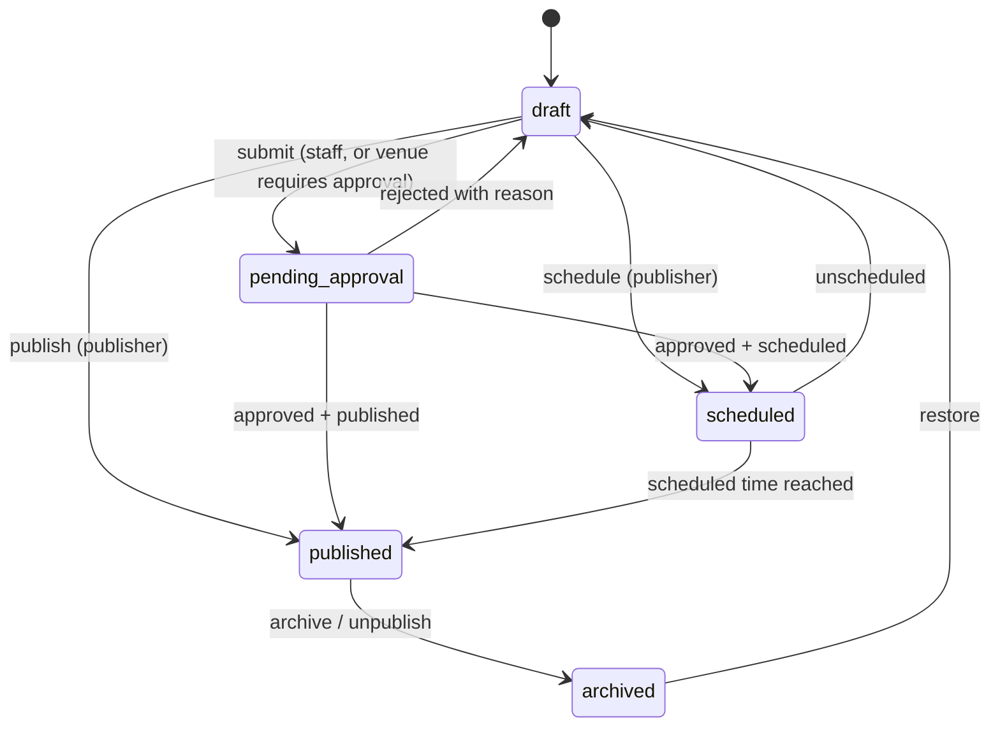

# VenuBoard — Data Model

**Status:** Reflects the decisions accepted on 2026-08-30 · **Stage:** Foundation schema plus platform-led onboarding · **Last updated:** 2026-09-01

This document describes the conceptual data model: the tenant hierarchy, the entities each module needs, how multilingual content is stored, how public and private data are separated, and how Row Level Security is expected to scope every tenant-owned record.

This is a **design document, not a schema dump**. Column lists are indicative. The staff presence module is implemented; see [staff-presence.md](./staff-presence.md). The private record is **business-scoped**; public profiles and presence are **venue-scoped**.

Related: [product-brief.md](./product-brief.md) · [architecture.md](./architecture.md) · [roles-and-permissions.md](./roles-and-permissions.md) · [staff-presence.md](./staff-presence.md)

---

## 1. Conventions

| Convention | Rule |
| --- | --- |
| Primary keys | UUID, server-generated |
| Tenant key | Every venue-owned table carries `venue_id` **directly**; every business-owned table carries `business_id` directly. Isolation is never inferred through a join chain. This applies to translation tables too |
| **Tenant-key integrity** | Wherever a child table duplicates its parent's tenant key, **the database prevents the two from disagreeing** via a composite foreign key. Never application validation alone — see [Tenant-key integrity constraints](#111-tenant-key-integrity-constraints) ([ADR-037](./decisions-and-open-questions.md#adr-037--duplicated-tenant-keys-are-protected-by-composite-foreign-keys)) |
| Timestamps | `created_at`, `updated_at` (UTC, `timestamptz`); display uses the venue timezone |
| Attribution | `created_by`, `updated_by` referencing the user; preserved after deactivation |
| Soft delete | `archived_at` for content, `deactivated_at` for people and memberships. Hard delete is reserved for retention-policy execution and legally required erasure |
| **Controlled vocabularies** | **No PostgreSQL enum types.** Stable internal workflow states are `text` columns with `CHECK` constraints; configurable or commercial concepts are reference tables — see [Controlled vocabularies](#10-controlled-vocabularies) ([ADR-031](./decisions-and-open-questions.md#adr-031--no-postgresql-enum-types)) |
| **Multilingual content** | **Normalised, entity-specific translation tables.** No locale-keyed JSON columns and no generic polymorphic translations table — see [Multilingual content](#12-multilingual-content) ([ADR-028](./decisions-and-open-questions.md#adr-028--normalised-entity-specific-translation-tables)) |
| RLS | Enabled and forced on every tenant table, translation tables included. No exceptions |
| Naming | `snake_case` tables and columns, plural table names; translation tables are named `<entity>_translations` |
| Money | Not modelled beyond billing state in MVP; no automated payment collection. Plan price points are undecided and are not represented by any assumed value |

Fields that are translated do **not** appear as text columns on their parent table. Where a table below is described as having "translated fields", the values live in that entity's translation table.

## 2. Tenant hierarchy

Reading the hierarchy:

- **Platform** — VenuBoard itself. Not a row per tenant; represented by platform-level tables (plans, modules, platform roles, audit, support sessions).
- **Business** — the customer entity. Owns venues and is the unit of business-level analytics, ownership and the combined subscription overview.
- **Venue** — the operational, public **and billing** unit. Every venue keeps independent branding, modules, content, configuration, analytics, **subscription** and public presence, even when several venues share one business ([ADR-030](./decisions-and-open-questions.md#adr-030--subscriptions-are-venue-scoped)).
- **User** — a person. One account, potentially many memberships.
- **Business membership** — a user's role within a business; inherits to all venues of that business.
- **Venue membership** — a user's role within a single venue; never leaks to sibling venues.
- **Platform role** — a completely separate axis; grants no tenant access by itself (see [roles-and-permissions.md](./roles-and-permissions.md#12-scope-rules)).

A user may belong to **multiple businesses and multiple venues with a different role in each**.

### 2.1 Core tenant tables

**`businesses`**

`id`, `name`, `legal_name`, `slug`, `country`, `default_locale`, `contact_email`, `status`, `created_at`, `updated_at`, `deactivated_at`

- `status` is `text` with `CHECK (status IN ('active','suspended','cancelled','scheduled_for_deletion','deleted'))`, deliberately using the same state names as `subscriptions.state` where they overlap. Business status is administrative; **billing state lives on each venue's subscription**, not here.

**`venues`**

`id`, `business_id`, `name`, `slug` (globally unique — used for the `venuboard.com` subdomain), `timezone`, `default_locale`, address fields, `latitude`, `longitude`, `directions_url`, `content_classification`, `classification_locked_by_platform` (boolean), `publication_state`, `status`, `created_at`, `updated_at`, `archived_at`

- Translated fields: **`venue_translations`** (optional localized `name`, description and tagline). The English operational name also lives on `venues.name`.
- `content_classification` is `text CHECK (... IN ('general','nightlife_18_plus'))`; `publication_state` is `text CHECK (... IN ('draft','published','unpublished_by_platform'))`.
- `slug` uniqueness is platform-wide because it maps to a public subdomain; a reserved-word list prevents collisions with platform routes.
- `classification_locked_by_platform` is how the operator **forces** an 18+ notice that the venue cannot lower.

**`venue_opening_hours`** — `id`, `venue_id`, `day_of_week`, `opens_at`, `closes_at`, `closes_next_day` (boolean), `is_closed`, plus dated exceptions in **`venue_hours_exceptions`** (`venue_id`, `date`, `opens_at`, `closes_at`, `is_closed`, `internal_note`).

> Nightlife hours routinely cross midnight; `closes_next_day` exists so "20:00–02:00" is representable without lying about the date.

**`venue_contacts`** — `id`, `venue_id`, `type` (`text CHECK (... IN ('phone','email','line','whatsapp','website'))`), `value`, `is_public`, `sort_order`. Translated fields: **`venue_contact_translations`** (label).

## 3. Identity, membership and invitations

**`users`** (application profile; authentication rows are owned by Supabase Auth)

`id` (matches the auth user id), `email`, `display_name`, `preferred_locale`, `avatar_url`, `account_status`, `mfa_enrolled_at`, `last_seen_at`, `created_at`, `updated_at`, `deactivated_at`

- `account_status` is `text CHECK (... IN ('pending','active','suspended','deactivated'))`.
- Both **email + password and email magic link** sign-in are supported; the method used is a property of the Supabase Auth session, not of this table ([ADR-013](./decisions-and-open-questions.md#adr-013--email-password-and-magic-link-authentication-with-mfa-support)).
- `mfa_enrolled_at` records MFA enrolment. MFA is supported for all users and **mandatory for platform accounts before production launch**; enrolment mechanics are undecided (OQ-40).

**`platform_roles`** — `id`, `user_id`, `role` (`text CHECK (... IN ('platform_admin','platform_support'))`), `granted_by`, `granted_at`, `revoked_at`. Deliberately a separate table so platform authority can never be produced by a tenant-side write.

**`business_memberships`** — `id`, `business_id`, `user_id`, `role` (`text CHECK (role = 'business_owner')` in MVP), `status`, `invited_by`, `accepted_at`, `deactivated_at`.

**`venue_memberships`** — `id`, `venue_id`, `user_id`, `role` (`text CHECK (... IN ('venue_manager','content_editor','booking_manager','staff'))`), `status`, `invited_by`, `accepted_at`, `deactivated_at`.

- Unique on (`venue_id`, `user_id`) for active rows: one role per person per venue in MVP.
- A `venue_manager` with several venues has several rows.
- Deactivating a membership never deletes it; history and attribution survive.

**`invitations`** — `id`, `email`, `scope_type` (`text CHECK (... IN ('business','venue'))`), `business_id`, `venue_id`, `role`, `token_hash`, `invited_by`, `expires_at`, `accepted_at`, `revoked_at`, `state` (`text CHECK (... IN ('pending','accepted','expired','revoked'))`).

- Tokens are stored hashed, single-use, and expiring.
- Constraint: exactly one of `business_id` / `venue_id` is set, consistent with `scope_type`.
- Acceptance is `public.accept_invitation(p_token)` — one transaction, tenant identifiers from the stored row. See [authentication.md](./authentication.md).
- There is **no public self-service signup** in the MVP; the first business owner of a new business is created by the platform operator ([ADR-033](./decisions-and-open-questions.md#adr-033--operator-led-onboarding-no-self-service-signup-in-the-mvp)).

## 4. Plans, subscriptions, entitlements and quotas

Two rules govern this area:

1. **Entitlement is granted by the platform operator; visibility is chosen by the venue.** See [architecture.md](./architecture.md#8-module-entitlement-resolution) for the resolution algorithm.
2. **Subscriptions are venue-scoped.** A business-level subscription row does not exist ([ADR-030](./decisions-and-open-questions.md#adr-030--subscriptions-are-venue-scoped)).

### 4.1 Reference tables (operator-maintained)

**`modules`** — `key` (primary key: `core_profile`, `staff_presence`, `feed`, `events`, `booking_requests`, `atmosphere`, `offers`, `social_links`), `name`, `description`, `is_core` (true only for `core_profile`), `is_available`, `sort_order`.

**`plans`** — `id`, `key`, `name`, `description`, `is_active`, `default_storage_quota_bytes`, `notes`. **Price is deliberately absent**: price points are undecided (OQ-05) and no placeholder amount is stored.

**`plan_modules`** — `plan_id`, `module_key`. Which modules a plan includes by default. Supports the accepted commercial shape of **a base plan plus optional modules**.

**`entitlement_sources`** — `key` (`plan`, `add_on`, `trial`, `override`), `name`, `precedence`. A reference table rather than a `CHECK` constraint because entitlement definitions are a commercial concept the operator may extend, and because precedence is data the resolver reads.

These are reference tables per [ADR-031](./decisions-and-open-questions.md#adr-031--no-postgresql-enum-types); their contents are managed by migrations, not by hand.

### 4.2 Subscriptions

**`subscriptions`** — `id`, **`venue_id` (mandatory, unique)**, `plan_id`, `state`, `trial_started_at`, `trial_ends_at`, `current_period_start`, `current_period_end`, `restricted_at`, `suspended_at`, `cancelled_at`, `delete_after`, `external_billing_ref` (reserved for Stripe later), `managed_manually` (boolean, true in MVP), `notes`

- `state` is `text CHECK (state IN ('trial','active','past_due','restricted','suspended','cancelled','scheduled_for_deletion','deleted'))`.
- **One subscription per venue.** Each venue therefore has its own state, plan, trial dates, entitlements, quota and billing records, so suspending one venue never affects its siblings.
- A **"business trial"** is the operator starting trials on all of a business's venues in one action; the state still lives per venue.
- `delete_after` implements the configurable retention period. **Its duration is undecided** — a policy and legal decision (OQ-01), and no default schedule is defined.

**`business_subscription_overview`** — a **derived view**, not a table: one row per business aggregating its venues' subscription states, trial end dates, quota usage and outstanding billing notes. It holds no state of its own, which is what keeps venue independence honest. Invoice consolidation is a later addition (OQ-39).

**`venue_billing_records`** — `id`, `venue_id`, `subscription_id`, `period_start`, `period_end`, `description`, `state` (`text CHECK (... IN ('draft','issued','paid','void'))`), `issued_at`, `paid_at`, `operator_reference`, `notes`. Recorded manually in MVP; **no amounts are assumed** while pricing is open.

### 4.3 Entitlements

**`venue_module_entitlements`** — the authoritative grant record.

`id`, `venue_id`, `module_key` (FK → `modules.key`), `source_key` (FK → `entitlement_sources.key`), `grant_type` (`text CHECK (grant_type IN ('allow','deny'))`), `starts_at`, `ends_at` (nullable = open-ended), `granted_by` (platform user), `reason`, `created_at`, `revoked_at`

- Supports **base plan plus optional modules**, **module-level start and expiry dates**, **trials of individual modules**, and **per-venue custom overrides** (including an explicit `deny` that outranks everything).
- A **standard 30-day trial inserts `allow` rows with `source_key = 'trial'` for every MVP module**, with `ends_at` at the trial end. The operator may omit modules from a given trial, extend the window, or grant a single-module trial ([ADR-029](./decisions-and-open-questions.md#adr-029--a-30-day-trial-grants-all-mvp-modules-by-default)).
- Writes require `manage_platform_entitlements`. **No tenant-side path exists to insert or modify this table** — enforced in RLS as well as in the application.

**`venue_module_settings`** — the venue's own switch for an entitled module.

`id`, `venue_id`, `module_key`, `is_enabled`, `is_publicly_visible`, `display_order`, `settings` (module-specific configuration), `updated_by`, `updated_at`. Translated fields: **`venue_module_setting_translations`** (public heading, for example "Staff in today").

- Requires `manage_venue_module_visibility`. Enabling a module that is not entitled is rejected at both layers.

**`venue_storage_usage`** — `venue_id`, `quota_bytes`, `used_bytes`, `warn_threshold_percent`, `last_recalculated_at`.

- Warning near the quota; **new uploads blocked past it**; existing content is never auto-deleted.
- Quota changes require `manage_platform_entitlements`.

**`trial_extensions`** — `id`, `subscription_id`, `extended_by`, `previous_trial_ends_at`, `new_trial_ends_at`, `reason`, `created_at`. Trials default to **30 days**; extensions are a platform action and are audited.

### 4.4 Subscription lifecycle

Every venue moves through this independently. All period durations (warning, restriction, suspension, retention) are **configurable and undecided** — see OQ-01 and OQ-02 in [decisions-and-open-questions.md](./decisions-and-open-questions.md#31-legal-policy-and-privacy--launch-blockers-not-scaffolding-blockers). No production deletion schedule is defined.

## 5. Staff: public and private data

See [staff-presence.md](./staff-presence.md) for the implemented module, including presence expiry, consent as an operational record, and avatar-upload deferral.

### 5.1 Staff public and private separation

Public staff data and private staff records are **different entities in different tables with different RLS policies**. No public query path can reach the private table. Anonymous users have **no table GRANT** on staff tables; the public site uses `list_public_staff_presence`.

### 5.2 `staff_members` — private, business-scoped

`id`, `business_id`, optional `user_id`, `internal_display_name`, `status` (`active` / `deactivated`), deactivation/restoration timestamps and actors, created/updated metadata.

- Never translated. Never exposed on the public site.
- Unique `(business_id, user_id)` where `user_id` is set. The same login may have separate rows in different businesses.
- Does **not** store legal name, email, phone, DOB, salary or home address.

### 5.3 `staff_public_profiles` — venue assignment and public profile

`id`, `venue_id`, `business_id`, `staff_member_id`, `public_display_name`, optional `public_title`, optional `avatar_storage_path`, `display_order`, `assignment_status`, `publication_state` (`draft` / `published`), `consent_state` (`pending` / `granted` / `withdrawn`), consent recorded at/by, quarantine columns.

- Translated fields: **`staff_public_profile_translations`** (short public bio).
- Composite FKs protect `(staff_member_id, business_id)` and `(venue_id, business_id)` (ADR-037).
- Publicly visible only when every gate in [staff-presence.md](./staff-presence.md#consent-and-publication) passes.

### 5.4 Staff presence — public availability indicator

**`current_staff_presence`** — `venue_id`, `staff_public_profile_id`, `state` (`present` / `not_present`), `changed_at`, `changed_by`, `presence_expires_at`, `source`

**`staff_presence_events`** — append-only history. Not public.

- Forgotten “present” rows expire: public reads treat `presence_expires_at <= now()` as `not_present` without a cron job.
- History is operational audit, **not** hours worked.

### 5.5 Consent history

**`staff_consent_events`** — append-only operational consent history per public profile. Manager-recorded consent is not legal proof.

## 6. Content modules

### 6.1 Venue profile, branding and navigation

**`venue_branding`** — `venue_id`, `primary_color`, `secondary_color`, `accent_color`, `background_color`, `text_color`, `theme_key`, `font_key`, `logo_media_id`, `background_media_id`, `updated_by`, `created_at`, `updated_at`.

- Colours are canonical `#RRGGBB` hex only (`CHECK` on each colour column). Theme keys reference `branding_themes`; font keys reference `branding_fonts`. The only seeded font is `system` (OQ-27).
- Logo and background media ids are **deferred placeholders**. Uploads are not implemented.
- There is **no** column for custom CSS, custom JavaScript, custom HTML or arbitrary code. This is a permanent structural constraint, not a missing feature.

**`branding_themes`** / **`branding_fonts`** — platform vocabulary tables (`key`, `name`, `sort_order`). Not tenant-writable.

**`platform_onboarding_runs`** — `idempotency_key` (UUID text), `payload_hash` (SHA-256 hex of the RPC payload text), `actor_user_id`, `business_id`, `venue_id`, `invitation_id`, `result_summary` (jsonb **without** raw invitation tokens), `created_at`. Platform-admin readable; not tenant-writable. Used so a retry after a timeout cannot create a second business, venue or invitation.

**`venue_navigation`** — `venue_id`, `item_key`, `sort_order`, `is_visible`. Translated fields: **`venue_navigation_translations`** (label).

**`venue_homepage_sections`** — `venue_id`, `module_key` or `venue_text_block_id`, `sort_order`, `is_visible`.

**`venue_text_blocks`** — `id`, `venue_id`, `key`, `sort_order`, `is_visible`. Translated fields: **`venue_text_block_translations`** (title and body, restricted formatting only).

**`venue_domains`** — `id`, `venue_id`, `hostname`, `type` (`text CHECK (type IN ('platform_subdomain','custom'))`), `verification_state` (`text CHECK (... IN ('pending','verifying','verified','failed'))`), `is_primary`, `requested_by`, `verified_by`, `verified_at`, `notes`.

- Every venue has exactly one `platform_subdomain` row derived from `venues.slug`.
- Custom domains are **manually configured in MVP**: recorded here, DNS pointed by the customer, added at the host by the operator, then marked verified.

### 6.2 Feed

**`feed_posts`** — `id`, `venue_id`, `state`, `scheduled_for`, `published_at`, `submitted_by`, `approved_by`, `approved_at`, `rejection_reason`, `created_by`, `updated_at`, `archived_at`

- `state` is `text CHECK (state IN ('draft','pending_approval','scheduled','published','archived'))`.
- Translated fields: **`post_translations`** (title and body).

**`feed_post_media`** — `id`, `post_id`, `venue_id`, `media_asset_id`, `sort_order`. Translated fields: **`post_media_translations`** (caption).

State machine:

- Only `published` posts are publicly readable — enforced in RLS, not only in queries.
- A post is publicly readable only if it has a translation row for the requested locale or a fallback locale; the fallback chain is in [Multilingual content](#12-multilingual-content).
- **Direct social publishing is not in MVP.** The model stores share links and optional embed references; it never assumes API access to ingest from or publish to Facebook, Instagram or X.

### 6.3 Events

**`events`** — `id`, `venue_id`, `starts_at`, `ends_at`, `timezone` (defaults to the venue timezone), `state` (`text CHECK (state IN ('draft','scheduled','published','cancelled','archived'))`), `cancellation_reason`, `cover_media_id`, `published_at`, `created_by`, `updated_at`, `archived_at`, `source_event_id` (set when copied from another venue), `recurrence_rule` (reserved, unused in MVP)

- Translated fields: **`event_translations`** (title and description).

**`event_media`** — `id`, `event_id`, `venue_id`, `media_asset_id`, `sort_order`

**`event_cross_promotions`** — `id`, `event_id`, `origin_venue_id`, `promoted_venue_id`, `created_by`, `created_at`, `removed_at`

- Both venues must belong to the **same business**, and the actor must be authorised in **both** (see [roles-and-permissions.md](./roles-and-permissions.md#5-conditional-rules), C18).
- **Copying** an event creates an independent event row — and its own translation rows — in the destination venue with `source_event_id` set; the copy then lives its own life. Cross-**promotion** instead surfaces one event on another venue's site without duplicating it.
- `recurrence_rule` is reserved so postponing recurrence does not require a later breaking change. It is unused and ignored in MVP.

### 6.4 Booking requests

**`booking_requests`** — `id`, `venue_id`, `reference`, `customer_name`, `customer_phone`, `customer_email`, `customer_line_id`, `party_size`, `requested_for` (timestamp), `requested_duration_minutes`, `customer_message`, `state`, `assigned_to_user_id`, `internal_notes`, `decline_reason`, `source` (`text CHECK (source IN ('public_site','admin_entered'))`), `created_at`, `updated_at`

- `state` is `text CHECK (state IN ('new','in_review','accepted','declined','cancelled_by_customer','no_show','completed'))`.

**`booking_request_events`** (append-only) — `id`, `booking_request_id`, `venue_id`, `from_state`, `to_state`, `changed_by`, `changed_at`, `note`, `assignment_change`

**`venue_booking_settings`** — `venue_id`, `is_accepting_requests`, `lead_time_minutes`, `max_party_size`, `required_fields`, `response_target_minutes`. Translated fields: **`venue_booking_setting_translations`** (public notice and auto-reply message).

Rules reflected in the model:

- **No real-time table inventory and no deposits in MVP.** There is no inventory, table, or payment entity. A request is an enquiry that a human accepts or declines.
- `customer_*` fields and `customer_message` are **restricted**: readable only with `view_booking_customer_details` (see [roles-and-permissions.md](./roles-and-permissions.md#8-public-and-private-data-access)).
- Customer-supplied text is **never translated**; it is stored as submitted.
- `internal_notes` is never publicly readable.
- **Reassignment is required** when an assigned employee is deactivated; deactivation is blocked until open bookings are reassigned.
- Full status history is retained in `booking_request_events`, including who changed what and when.
- Retention of customer contact data after a booking concludes is undecided (OQ-22).

### 6.5 Atmosphere

**`venue_atmosphere`** — `venue_id`, `level` (`text CHECK (level IN ('quiet','getting_busy','lively','packed'))`), `updated_by`, `updated_at`, `stale_after_minutes`, `expires_at`. Translated fields: **`venue_atmosphere_translations`** (optional custom public wording per level).

- The public site shows the level, the optional custom wording, and **when it was last updated**.
- Once `expires_at` passes (derived from `updated_at + stale_after_minutes`, configurable per venue), the value is **treated as stale and not displayed** rather than shown misleadingly.
- Optional `venue_atmosphere_events` history supports "busy nights" analytics.

### 6.6 Offers and promotions

**`offers`** — `id`, `venue_id`, `image_media_id`, `valid_from`, `valid_to`, `state` (`text CHECK (state IN ('draft','published','archived'))`), `redemption_tracking_enabled`, `redemption_count`, `published_at`, `created_by`, `updated_at`, `archived_at`

- Translated fields: **`offer_translations`** (title, description and terms).

**`offer_redemptions`** — `id`, `offer_id`, `venue_id`, `redeemed_at`, `recorded_by`, `channel` (`text CHECK (channel IN ('staff_recorded','public_code'))`), `note`

- "Expired" is **derived** from `valid_to`, not stored as a state.
- Redemption tracking is deliberately basic in MVP: a counter plus optional simple events. No coupon engine, no per-customer identity, no loyalty accounts.

### 6.7 Social and contact links

**`venue_social_links`** — `id`, `venue_id`, `platform` (`text CHECK (platform IN ('facebook','instagram','x','tiktok','youtube','line','whatsapp','phone','website'))`), `url_or_handle`, `sort_order`, `is_visible`. Translated fields: **`venue_social_link_translations`** (label).

- Values are validated per platform type; only known-safe link shapes are accepted.
- Share buttons are rendered from platform-maintained share targets, not from venue-supplied markup.
- Every outbound click is recorded as an analytics event (see [Analytics](#7-analytics)).

### 6.8 Media assets

**`media_assets`** — `id`, `venue_id`, `storage_path`, `kind` (`text CHECK (kind IN ('image','video'))`), `mime_type`, `byte_size`, `width`, `height`, `duration_seconds`, `uploaded_by`, `created_at`, `moderation_state` (`text CHECK (... IN ('ok','flagged','quarantined'))`), `archived_at`

- Translated fields: **`media_asset_translations`** (alt text).
- Storage paths are venue-prefixed so storage policies can enforce isolation, and buckets are **per environment** with no sharing between them.
- `byte_size` drives `venue_storage_usage`; uploads are rejected once the quota is exceeded.
- `moderation_state` follows the platform quarantine rules in [Platform moderation and quarantine](#69-platform-moderation-and-quarantine); a `quarantined` asset is never served publicly and cannot be re-attached to published content.

### 6.9 Platform moderation and quarantine

Accepted as [ADR-036](./decisions-and-open-questions.md#adr-036--moderate_content-as-a-platform-action). The `moderate_content` action needs to survive a venue simply pressing "publish" again, so quarantine is **structural, not cosmetic**.

**Quarantine columns on every publishable entity** — `venues`, `feed_posts`, `events`, `offers`, `staff_public_profiles`, `venue_text_blocks`, `media_assets`:

`platform_quarantined_at` (nullable), `platform_quarantine_reason` (`text`, required whenever `platform_quarantined_at` is set), `platform_quarantined_by` (platform user).

Two entities already carry a state that a takedown also sets, and the two must agree: a venue-level takedown sets `venues.publication_state = 'unpublished_by_platform'`, and a media takedown sets `media_assets.moderation_state = 'quarantined'`. In both cases the quarantine columns carry the **who, when and why**; the existing state column carries the **visibility**.

Rules enforced in the database, not the interface:

- **Publication is impossible while quarantined.** Each publishable table carries a `CHECK` constraint of the form "either `platform_quarantined_at IS NULL`, or the publication state is not a publicly visible one". A venue user cannot republish, unarchive, reschedule or otherwise re-expose a quarantined record — the write is rejected.
- **Quarantine columns are platform-write-only**, in the same way entitlements are (see [Entitlements](#43-entitlements)). No venue-facing role can clear its own quarantine, and the venue-scoped update policy excludes these columns.
- **A reason is mandatory.** The `CHECK` constraint requires `platform_quarantine_reason` to be present whenever `platform_quarantined_at` is set. A takedown with no stated reason cannot be written.
- **The content is preserved.** Quarantine sets a flag and hides the record; it does not delete the row, its translations or its media. Deletion happens only where legally required, and then through the retention/erasure path in [section 13](#13-retention-export-and-deletion).

**`moderation_actions`** (append-only) — `id`, `occurred_at`, `platform_user_id`, `venue_id`, `target_table`, `target_id`, `action` (`text CHECK (action IN ('quarantine','unpublish','restore'))`), `previous_state`, `resulting_state`, `reason` (`NOT NULL`), `evidence_note`, `audit_log_id`

- Every moderation action records the acting platform user, the venue, the affected resource, the **previous state**, the **resulting state**, the reason and the timestamp. `restore` is recorded to exactly the same standard as a takedown.
- Entries are append-only and retained regardless of tenant retention settings, because they are the operator's evidence in a dispute or a legal request.
- Each row also links to its `audit_log` entry, so moderation appears in the normal audit trail while remaining separately queryable — a takedown must be distinguishable from ordinary support activity.
- `platform_support` cannot write to this table; only `platform_admin` holds `moderate_content` ([roles-and-permissions.md](./roles-and-permissions.md#41-moderate_content-rules)).

## 7. Analytics

**`analytics_events`** (append-only, high volume) — `id`, `venue_id`, `event_type`, `occurred_at`, `session_hash`, `is_returning_visitor`, `entity_type`, `entity_id`, `locale`, `device_class`, `referrer_class`, `country`

`event_type` is a `text` column constrained by `CHECK` and covers the outcomes listed in [product-brief.md](./product-brief.md#14-analytics): `page_view`, `directions_click`, `line_click`, `whatsapp_click`, `phone_click`, `social_click`, `booking_request_submitted`, `booking_accepted`, `event_view`, `offer_view`, `offer_redemption`, `staff_profile_view`, `post_view`, `module_interaction`.

**`analytics_daily_rollups`** — `venue_id`, `date`, `event_type`, `entity_type`, `entity_id`, `count`, plus derived measures such as booking conversion.

**`venue_module_usage`** (operator-facing) — `venue_id`, `module_key`, `date`, `admin_write_count`, `public_view_count`.

Privacy rules baked into the model:

- No raw IP addresses, no cross-site identifiers, no advertising pixels. `session_hash` is salted, rotating and not reversible to a person.
- `staff_profile_view` events are only recorded for staff with current public consent, and are only ever reported in aggregate.
- Raw events have a **shorter retention than rollups**; both durations are undecided (OQ-14).
- **Revenue attribution is a future enhancement** and has no entity here — it would require reliable venue revenue data, which implies POS integration (a non-goal).
- Business-level analytics are computed by aggregating the venues of a business; **venue-level analytics remain independently viewable**.

## 8. Notifications

**`notification_preferences`** — `id`, `user_id`, `venue_id` (nullable = user-wide default), `category` (`text CHECK (category IN ('booking_request','content_approval','invitation','quota_warning','billing_state','support_session','system'))`), `in_app_enabled`, `email_enabled`, `line_enabled` (reserved for later), `updated_at`

**`notifications`** — `id`, `user_id`, `venue_id`, `category`, `title`, `body`, `link`, `read_at`, `created_at`

**`notification_deliveries`** — `id`, `notification_id`, `channel` (`text CHECK (channel IN ('in_app','email','line'))`), `state` (`text CHECK (state IN ('queued','sent','failed','suppressed'))`), `attempted_at`, `error`

- Preferences are resolved **per user and per venue**; a venue-specific row overrides the user's default.
- **Defaults are conservative** — never all channels at once. LINE is reserved and unused in MVP.
- Notification bodies are composed from interface message catalogues in the recipient's `preferred_locale`, not from translation tables.

## 9. Audit and support sessions

**`audit_log`** (append-only) — `id`, `occurred_at`, `actor_user_id`, `actor_platform_role`, `support_session_id` (nullable), `action`, `scope_type` (`text CHECK (... IN ('platform','business','venue','self'))`), `business_id`, `venue_id`, `target_table`, `target_id`, `summary`, `metadata`, `outcome` (`text CHECK (outcome IN ('success','denied','error'))`), `request_id`, `environment`

- `environment` records which environment produced the entry, so a staging entry can never be mistaken for a production one ([ADR-034](./decisions-and-open-questions.md#adr-034--three-fully-isolated-environments-local-staging-production)).

**`support_sessions`** — `id`, `operator_user_id`, `target_business_id`, `target_venue_id`, `reason`, `ticket_reference`, `mode` (`text CHECK (mode IN ('read_only','write'))`), `write_granted_by`, `write_granted_at`, `write_expires_at`, `started_at`, `ended_at`, `expires_at`, `end_reason`

- **No open session ⇒ no platform access to tenant data**, whatever the platform role. See [roles-and-permissions.md](./roles-and-permissions.md#7-platform-support-and-impersonation).
- Sessions never store or expose passwords, hashes, magic-link tokens or any other authentication secret.
- Every session start/end, write grant, write action, and (where practical) read of restricted data produces an `audit_log` row carrying `support_session_id`.
- Audit rows are insert-only: no update or delete policy exists for any role.

**`consent_log`** and **`policy_acceptances`** — records of staff consent changes and of business owners accepting terms/DPA versions (needed once legal documents exist; see OQ-03).

## 10. Controlled vocabularies

**No PostgreSQL enum types are used anywhere** ([ADR-031](./decisions-and-open-questions.md#adr-031--no-postgresql-enum-types)). Controlled vocabularies are expressed in one of two ways.

### 10.1 Text columns with `CHECK` constraints — stable internal workflow states

These change only through a reviewed migration that alters one constraint.

| Vocabulary | Column | Permitted values |
| --- | --- | --- |
| Platform role | `platform_roles.role` | `platform_admin`, `platform_support` |
| Business role | `business_memberships.role` | `business_owner` |
| Venue role | `venue_memberships.role` | `venue_manager`, `content_editor`, `booking_manager`, `staff` |
| Account / membership status | `users.account_status`, `*_memberships.status` | `pending`, `active`, `suspended`, `deactivated` |
| Business status | `businesses.status` | `active`, `suspended`, `cancelled`, `scheduled_for_deletion`, `deleted` |
| Subscription state | `subscriptions.state` | `trial`, `active`, `past_due`, `restricted`, `suspended`, `cancelled`, `scheduled_for_deletion`, `deleted` |
| Entitlement grant type | `venue_module_entitlements.grant_type` | `allow`, `deny` |
| Feed post state | `feed_posts.state` | `draft`, `pending_approval`, `scheduled`, `published`, `archived` |
| Event state | `events.state` | `draft`, `scheduled`, `published`, `cancelled`, `archived` |
| Offer state | `offers.state` | `draft`, `published`, `archived` |
| Booking state | `booking_requests.state` | `new`, `in_review`, `accepted`, `declined`, `cancelled_by_customer`, `no_show`, `completed` |
| Invitation state | `invitations.state` | `pending`, `accepted`, `expired`, `revoked` |
| Presence state | `current_staff_presence.state` | `present`, `not_present` |
| Atmosphere level | `venue_atmosphere.level` | `quiet`, `getting_busy`, `lively`, `packed` |
| Content classification | `venues.content_classification` | `general`, `nightlife_18_plus` |
| Venue publication state | `venues.publication_state` | `draft`, `published`, `unpublished_by_platform` |
| Support session mode | `support_sessions.mode` | `read_only`, `write` |
| Media moderation state | `media_assets.moderation_state` | `ok`, `flagged`, `quarantined` |
| Moderation action | `moderation_actions.action` | `quarantine`, `unpublish`, `restore` |
| Locale | every `*_translations.locale`, `users.preferred_locale`, `*.default_locale` | `en`, `th` |
| Environment | `audit_log.environment` | `local`, `staging`, `production` |

### 10.2 Reference tables — configurable or commercial concepts

The operator can extend these as data, without a schema change: **`modules`**, **`plans`**, **`plan_modules`**, **`entitlement_sources`**. Foreign keys from `venue_module_entitlements`, `venue_module_settings`, `plan_modules` and `subscriptions` point at them.

### 10.3 TypeScript consistency

TypeScript union types (and the Zod schemas of [ADR-016](./decisions-and-open-questions.md#adr-016--zod-for-validation-react-hook-form-for-complex-forms)) are **generated from, or maintained consistently with, the database constraints**, and a test asserts that every permitted database value has a corresponding TypeScript member and vice versa. Without that test, the two drift silently — which is the one real cost of not using enum types.

## 11. Row Level Security patterns

Every tenant table falls into one of these classes. See [architecture.md](./architecture.md#7-tenant-isolation) for the enforcement stack.

| Class | Examples | Read | Write |
| --- | --- | --- | --- |
| **Public-readable content** | `feed_posts`, `events`, `offers`, `staff_public_profiles`, `current_staff_presence`, `venue_atmosphere`, `venue_social_links`, `venue_branding`, `venue_text_blocks` | Anonymous role may read **only** rows where the venue is published, the module is entitled **and** enabled, the record is `published`, `platform_quarantined_at IS NULL` (and, for staff, consent is current) | Members with the relevant action, in that venue only — **excluding** the platform quarantine columns, which no tenant role may write ([section 6.9](#69-platform-moderation-and-quarantine)) |
| **Public-readable translations** | `venue_translations`, `post_translations`, `event_translations`, `offer_translations` and the other `*_translations` tables of public entities | Anonymous role may read a translation row **only if it may read the parent row**. Policies test the parent's visibility, never just `venue_id` | Whoever may write the parent record |
| **Tenant-private** | `staff_private_details`, `booking_requests`, `venue_booking_settings`, `invitations`, `notification_preferences` | Members with the relevant action, in that venue/business only. **No anonymous policy exists at all** | Same, action-gated |
| **Platform-controlled** | `venue_module_entitlements`, `plans`, `plan_modules`, `modules`, `entitlement_sources`, `subscriptions`, `venue_billing_records`, `venue_storage_usage`, `platform_roles`, `trial_extensions` | Tenants may read their **own** subscription, entitlement and quota state (needed to render the admin panel). Reference tables are readable by authenticated users | **Platform only.** No tenant write policy exists |
| **Append-only records** | `audit_log`, `booking_request_events`, `staff_presence_events`, `analytics_events`, `consent_log` | Scoped read per action; audit read is narrow | Insert only; no update or delete policy for any role |
| **Platform append-only** | `moderation_actions` | Platform roles read all; a venue may read the entries affecting its own records (subject to OQ-15) | **Insert only, `platform_admin` only.** No tenant write policy, no update or delete policy for anyone |
| **Cross-tenant by design** | `event_cross_promotions` | Readable by members of either venue; publicly readable only when the promoted event is published and both venues are published | Requires authorisation in **both** venues, same business |

Additional rules:

- Policies are written **per operation** (`SELECT` / `INSERT` / `UPDATE` / `DELETE`), never as one permissive `FOR ALL`.
- Membership resolution uses `SECURITY DEFINER` helper functions over the membership tables, indexed on (`user_id`, `venue_id`) and (`user_id`, `business_id`). Their performance at realistic volume is **measured during the first schema implementation, against representative tenant data, before the schema becomes expensive to change** (OQ-30).
- Every translation table carries `venue_id` so its policy never needs a join purely to establish tenancy, and it is additionally checked against parent visibility for public reads.
- The service-role key is never used on a request path serving tenant users.
- A migration introducing a tenant table — **including a translation table** — without policies, integrity constraints and isolation tests does not merge.

### 11.1 Tenant-key integrity constraints

Accepted as [ADR-037](./decisions-and-open-questions.md#adr-037--duplicated-tenant-keys-are-protected-by-composite-foreign-keys). The direct tenant key of [ADR-006](./decisions-and-open-questions.md#adr-006--a-direct-tenant-key-on-every-tenant-owned-table) is what makes the policies above simple and fast, and it is deliberate denormalisation. **That denormalisation must be protected at the database level**, because a child row whose `venue_id` disagreed with its parent's would be readable by the wrong tenant under a policy that only checks `venue_id`. That is a cross-tenant leak produced by one bad insert.

For every tenant-owned parent with a tenant-keyed child — translations first, but not only translations:

| Requirement | Constraint |
| --- | --- |
| The parent must be addressable by tenant | `UNIQUE (id, venue_id)` on the parent, in addition to its primary key on `id` |
| The child cannot claim a different tenant | **Composite foreign key** `(<parent>_id, venue_id)` → parent `(id, venue_id)`, `ON DELETE CASCADE` |
| One translation per locale | `UNIQUE (<parent>_id, locale)` on the translation table |
| Both facts are database facts | The parent relationship **and** the locale uniqueness are enforced by constraints, not by application code |

Consequences and rules:

- A translation row is **structurally unable** to reference a parent in one venue while claiming another. It is not "validated"; it is impossible.
- **Application validation alone is never sufficient.** The guarantee must hold for ad-hoc SQL, migrations, background jobs, future contributors and any code path that forgets to check.
- Isolation tests **attempt** cross-venue parent/child mismatches and assert that the database **rejects** them. A test that only checks the happy path does not satisfy this requirement.
- The same principle applies to **every child table that duplicates a tenant key for direct RLS**, not only translations: `feed_post_media`, `event_media`, `offer_redemptions`, `staff_presence_events`, `booking_request_events`, `staff_public_consents`, `venue_navigation`, `venue_text_blocks`, `venue_contacts`, `venue_social_links`, `media_assets` and any table added later. Its tenant identifier must not be able to disagree with its parent's.
- `event_cross_promotions` is the one intentional cross-tenant table and is handled explicitly: each side is composite-keyed to its own venue, and both venues must belong to the same business.
- Adding a tenant-keyed child table means adding its composite key **in the same migration** ([ADR-012](./decisions-and-open-questions.md#adr-012--sql-migrations-in-the-repository-forward-only)). The cost is one extra unique index per parent; the alternative is trusting every future write path forever.

## 12. Multilingual content

**Decision:** venue-authored content is stored in **normalised, entity-specific translation tables**, one per translatable entity ([ADR-028](./decisions-and-open-questions.md#adr-028--normalised-entity-specific-translation-tables)). Locale-keyed JSON columns and a single generic polymorphic translations table are both **rejected**.

### 12.1 Common shape

Every `*_translations` table has:

| Column | Purpose |
| --- | --- |
| `id` | UUID primary key |
| `<parent>_id` | Part of the **composite** foreign key to the parent row, `ON DELETE CASCADE` |
| `venue_id` | Direct tenant key for RLS ([ADR-006](./decisions-and-open-questions.md#adr-006--a-direct-tenant-key-on-every-tenant-owned-table)), and the other half of that composite key |
| `locale` | `text CHECK (locale IN ('en','th'))` |
| translated fields | The actual text, typed and constrained per entity |
| `created_at`, `updated_at`, `updated_by` | Attribution and freshness, so "which venues have stale Thai copy" is answerable |

Constraints:

- `UNIQUE (<parent>_id, locale)` — one row per parent per locale.
- **Composite foreign key** `(<parent>_id, venue_id)` → parent `(id, venue_id)`, so a translation cannot claim a different venue from the row it translates. The parent therefore carries `UNIQUE (id, venue_id)`. This is mandatory, not optional — see [Tenant-key integrity constraints](#111-tenant-key-integrity-constraints).
- An index on (`venue_id`, `locale`) for coverage reporting.

### 12.2 The translation tables

| Table | Parent | Translated fields |
| --- | --- | --- |
| `venue_translations` | `venues` | name, description, tagline |
| `venue_contact_translations` | `venue_contacts` | label |
| `venue_navigation_translations` | `venue_navigation` | label |
| `venue_text_block_translations` | `venue_text_blocks` | title, body |
| `venue_module_setting_translations` | `venue_module_settings` | public heading |
| `venue_social_link_translations` | `venue_social_links` | label |
| `venue_atmosphere_translations` | `venue_atmosphere` | custom public wording |
| `venue_booking_setting_translations` | `venue_booking_settings` | public notice, auto-reply message |
| `staff_public_profile_translations` | `staff_public_profiles` | public bio |
| `post_translations` | `feed_posts` | title, body |
| `post_media_translations` | `feed_post_media` | caption |
| `event_translations` | `events` | title, description |
| `offer_translations` | `offers` | title, description, terms |
| `media_asset_translations` | `media_assets` | alt text |

Deliberately **not** translated: private staff records, internal notes, booking customer submissions, audit summaries, and anything the venue's own team reads rather than publishes.

### 12.3 Resolution and partial translation

- Display order is **requested locale → the venue's `default_locale` → any available locale**.
- A missing translation never renders as an empty field, and untranslated content is **marked honestly** rather than machine-translated.
- Partial translation is a normal, expected state. Because translations are rows, "which published posts lack a Thai translation" is a simple query, which is what the admin panel's translation-coverage view is built on.
- Interface strings are separate: they live in message catalogues in the repository, not in the database.

### 12.4 Costs accepted with this decision

More tables, one join per translatable entity per locale, and a translation row to write alongside every content write. In exchange: real foreign keys, per-field typing and constraints, useful indexes, straightforward coverage reporting, and no untyped JSON blob to migrate later.

## 13. Retention, export and deletion

- **Venues own their content** — posts, images, events, bookings, customer lists, and every translation of them. Export must produce all of it in a portable form (`export_data`).
- **Cancellation** starts a retention window (`subscriptions.delete_after`) for that venue; during it, data is recoverable and exportable. Because subscriptions are venue-scoped, one venue can be in retention while its siblings trade normally.
- **Deletion** is then either hard deletion or anonymisation per policy. Anonymisation keeps aggregate analytics meaningful while removing personal data.
- Audit and consent records may need to outlive tenant content for legal defensibility — **that tension is unresolved** (OQ-03).
- **No retention duration is proposed in this document, and no production deletion schedule is defined.** Every duration is configurable and awaits policy and legal advice (OQ-01, OQ-02).

## 14. Seed data for local and staging

The application ships a **deterministic, repeatable seed dataset** for local and staging environments, plus fixed automated-test identities ([ADR-035](./decisions-and-open-questions.md#adr-035--deterministic-repeatable-seed-data-and-fixed-test-identities)). It is demo data, not reference data: the contents of `modules`, `plans`, `plan_modules` and `entitlement_sources` are managed by migrations instead.

### 14.1 Non-negotiable rules

- **All names, images, email addresses, phone numbers and contact details are fictional.** Genuine customer or staff information is never included, and fictional venues must not resemble real venues in the target cities (OQ-37).
- **Production customer data is never used as seed data**, in whole or in part.
- Seeding is **deterministic**: fixed UUIDs and timestamps relative to a seed epoch, so tests can assert against known rows and repeated runs produce identical databases.
- The reset-and-seed workflow **refuses to run when the environment is production**.
- Test credentials come from environment variables or secure test configuration and are **never committed**.

### 14.2 Coverage the dataset must provide

| Area | What the dataset contains |
| --- | --- |
| Business shapes | An independent single-venue business, and a multi-venue business with several venues under one owner |
| Content classification | Both `general` and `nightlife_18_plus` venues, including one where the operator has forced and locked the classification |
| Branding and modules | Venues with visibly different palettes, fonts and homepage/navigation ordering, and different module enable/visibility combinations |
| Subscription states | Every value of `subscriptions.state`, including a venue in `restricted` and one in `suspended`, so the gating rules are exercised |
| Trial states | A fresh 30-day trial with all modules, a trial with operator exclusions, an extended trial, a single-module trial, and an expired trial whose modules have dropped off the public site |
| Storage quotas | A venue comfortably inside quota, one inside the warning threshold, and one over quota so upload blocking is testable |
| Roles | At least one user in every fixed role: `platform_admin`, `platform_support`, `business_owner`, `venue_manager`, `content_editor`, `booking_manager`, `staff` |
| Multi-membership | A user who is `business_owner` in one business and `staff` in another; a venue manager over several venues; staff working at two venues |
| Staff lifecycle | Staff present and absent, with and without consent, one deactivated (with work already reassigned), and one deactivated then restored |
| Content states | Every state of `feed_posts`, `events` and `offers`, including scheduled items either side of the seed epoch and a post awaiting approval |
| Translations | Fully bilingual content, English-only content, Thai-only content, and deliberately partial translations so the fallback chain and coverage view are exercised |
| Bookings | Requests in every state, assigned and unassigned, with internal notes and restricted customer details |
| Atmosphere | A fresh atmosphere value and a deliberately stale one past `expires_at` |
| Support and audit | Completed read-only and write support sessions with matching `audit_log` entries, plus an expired session |
| Moderation | A quarantined post and a quarantined media asset, each with a recorded reason and `moderation_actions` entries, so the republication block and the restore path are testable |
| Negative scenarios | Fixtures whose only purpose is to be inaccessible or rejected: a second tenant's records for cross-tenant tests, role/action pairs expected to be denied, and the write attempts that must fail — a cross-venue parent/translation mismatch ([section 11.1](#111-tenant-key-integrity-constraints)) and a venue republishing quarantined content ([section 6.9](#69-platform-moderation-and-quarantine)) |

### 14.3 Fixed test identities

One account per role, with stable identifiers and predictable memberships, referenced by name from the permission and isolation suites so a matrix cell maps to a real login. Because the accounts are fixed and the memberships known, "user A of tenant A cannot read tenant B" becomes a direct assertion rather than a setup exercise. Passwords and tokens for these accounts come from environment configuration.

## 15. Known modelling gaps

Deliberately unresolved and tracked as open questions rather than quietly assumed:

1. Video storage strategy and size caps (OQ-13).
2. Analytics raw-event retention and rollup granularity (OQ-14).
3. Whether presence auto-expiry is on by default and at what time (OQ-21).
4. How much of the audit log a business owner may see (OQ-15).
5. Whether restricted personal data is masked by default with an audited reveal (OQ-17).
6. Whether a venue may ever have more than one role per user — MVP says no, and the unique constraint enforces it.
7. RLS helper-function performance at realistic volume (OQ-30) — **measured during the first schema implementation**, not left until the schema is expensive to change.
8. MFA enrolment and recovery mechanics, and therefore what `users.mfa_enrolled_at` must support (OQ-40). The column exists from the start; the flows are a pre-production decision ([ADR-038](./decisions-and-open-questions.md#adr-038--provisional-boundaries-for-the-four-non-blocking-feature-questions)).

None of these blocks writing the schema. Resolved since the first revision: multilingual storage (now [section 12](#12-multilingual-content)), controlled vocabularies (now [section 10](#10-controlled-vocabularies)), subscription scoping (now [section 4.2](#42-subscriptions)), platform moderation (now [section 6.9](#69-platform-moderation-and-quarantine)) and tenant-key integrity (now [section 11.1](#111-tenant-key-integrity-constraints)).
