# VenuBoard — Product Brief

**Status:** Scope accepted 2026-08-30 · **Stage:** Pre-scaffold documentation · **Last updated:** 2026-08-30

This document describes what VenuBoard is, who it is for, what ships in the first release (MVP), and what is deliberately out of scope. Technical design lives in [architecture.md](./architecture.md); permissions live in [roles-and-permissions.md](./roles-and-permissions.md); unresolved matters live in [decisions-and-open-questions.md](./decisions-and-open-questions.md).

Throughout this documentation set:

- **MVP** means confirmed scope for the first release.
- **Later** means a deliberate future possibility, not a commitment.
- **OPEN** means an unresolved question. Every OPEN item is tracked in [decisions-and-open-questions.md](./decisions-and-open-questions.md) and must not be treated as decided.

Pricing, retention durations and the legal documentation set remain **OPEN**. No amount, duration or deletion schedule is assumed anywhere in these documents.

---

## 1. Summary

VenuBoard is a **modular, multi-tenant, white-label website and management platform for venues**.

Each venue that subscribes receives:

1. A **branded public-facing website** (its own subdomain, optionally its own custom domain).
2. A **venue administration panel** for owners, managers and staff.
3. A set of **optional modules**, switched on by the venue's subscription and entitlements.

The VenuBoard operator runs a separate **platform administration panel** to manage customers, businesses, venues, subscriptions, trials, entitlements, support access and platform operations.

VenuBoard is **one shared SaaS platform**: one codebase, one deployment, one database, many tenants. There is no per-customer deployment, per-customer database or per-customer fork.

## 2. Initial market and expansion path

**Initial target (MVP focus):** small-to-medium independent bars in Thailand, especially nightlife destinations such as Pattaya, Phuket, Patong and Koh Samui. These businesses typically have:

- No website, or an abandoned one nobody can edit.
- A presence spread thinly across Facebook, Instagram, LINE and Google Maps.
- Staff-driven customer relationships and highly perishable information ("who is working tonight", "how busy is it now", "what is on this week").
- Non-technical operators who update things from a phone, often bilingually (Thai and English), often late at night.

**Deliberate expansion path (later):** larger clubs, hospitality groups, restaurants, entertainment venues, and other venue types.

**Design consequence:** nothing in the domain model, terminology or schema may hard-code assumptions that a tenant is a bar or that its content is adult nightlife. "Venue" is the generic tenant unit. Nightlife-specific behaviour (for example the 18+ notice, staff presence, atmosphere indicator) is expressed as **optional modules and per-venue settings**, never as platform-wide assumptions. See [Adult-content classification](#11-adult-content-classification).

## 3. Problems VenuBoard solves

| Problem | VenuBoard's answer |
| --- | --- |
| No credible, mobile-first web presence | Branded public site generated from structured venue data |
| Information rots because editing is hard | Phone-first admin panel; a post or event takes under a minute |
| "Who is in tonight?" is the most-asked question and lives nowhere | Staff presence module with a fast toggle and a public display |
| Customers cannot tell whether it is worth going out now | Atmosphere indicator with staleness expiry |
| Booking enquiries scattered across chat apps | Structured booking requests with owner assignment and status history |
| Multi-venue operators duplicate everything | One business, many venues, shared users, independent venue presence |
| Owners have no idea what actually drives visits | Outcome-focused analytics (direction clicks, LINE clicks, booking conversion) rather than vanity page views |

## 4. Product principles

1. **Phone-first for operators, not just customers.** The admin panel is used one-handed, standing up, in a loud room.
2. **Structured content, not a page builder.** Venues configure branding and content; they do not author CSS, scripts or free-form layout. This keeps every site fast, accessible, translatable and safe. See [Non-goals](#17-non-goals-for-the-first-release).
3. **Entitlements are the operator's decision; visibility is the venue's decision.** A venue can never grant itself a module it has not bought or been given.
4. **Tenant isolation is a security property, not a filtering convenience.** Enforced in the database and in the application. See [architecture.md](./architecture.md#7-tenant-isolation).
5. **Public and private data are separated by design.** Public staff profiles and private employment data are different things and live in different tables with different access rules.
6. **Deactivate, do not destroy.** People leave and come back; history must survive.
7. **Bilingual from day one.** English and Thai are first-class, not an afterthought.
8. **Every meaningful action is auditable**, especially anything the platform operator does inside a customer's tenant.

## 5. Application surfaces

Three clearly separated surfaces share one codebase and one database.

### 5.1 Public venue website

- Audience: customers and prospective customers.
- Public, mobile-first, fast, indexable, bilingual (EN/TH).
- **No account required** for ordinary browsing, including viewing staff presence, feed, events, offers and atmosphere, and submitting a booking request.
- Routing concept:
  - Venue subdomain: `[venue-slug].venuboard.com`
  - Custom venue domain (for example `www.example-bar.com`)
  - Local development / fallback path: `/v/[venue-slug]`
- Only content that is **published**, from a module that is both **entitled** and **enabled**, is ever visible.

### 5.2 Venue administration panel

- Route: `/admin`
- Audience: business owners, venue managers, content editors, booking managers, staff.
- Users must **select or switch their active business and venue** based on their memberships; the active venue scopes everything they see and do.
- Shows only the modules that the venue is entitled to.

### 5.3 Platform administration panel

- Route: `/platform`
- Audience: the VenuBoard operator and authorised support accounts only.
- Manages businesses, venues, plans, subscriptions, trials, entitlements, storage quotas, domains, content classification enforcement, support sessions and audit logs.
- **Platform access is completely separate from venue-level roles.** Holding a platform role grants no venue role, and no venue role can ever escalate into platform access.

## 6. MVP modules

Every module below is in MVP scope. Each is independently entitled and independently switchable by the venue (except the core venue profile, which is always present).

Module state resolution — a module is publicly visible only if **entitled AND enabled AND has publishable content**. See [Module entitlements](#7-module-entitlements).

### 6.1 Core venue profile (always included)

Identity, contact, presentation and localisation of the venue:

- Venue name and description
- Address and map/directions link
- Opening hours
- Contact information
- LINE, WhatsApp, phone and social links
- Logo
- Brand colours
- Fonts **selected from an approved list**
- Background image
- Navigation order
- Homepage module order
- Custom text blocks
- Temporary VenuBoard subdomain (always issued)
- Optional custom domain
- English and Thai content

Explicitly **not allowed**: custom CSS, arbitrary JavaScript, embedded `<script>`, HTML injection, or any other arbitrary code injection.

### 6.2 Staff presence

The signature module for the initial market.

- Public staff display name
- Initials placeholder (avatar upload deferred)
- Optional short public bio
- "In now" / "not currently in" state (`present` / `not_present`)
- Fast, mobile-friendly toggle
- Public carousel of eligible staff with a live-status indicator
- Configurable public heading, for example "Staff in today"
- A staff member may belong to **more than one venue**; presence state is **per venue**

See [staff-presence.md](./staff-presence.md). Public pages do **not** show exact attendance timestamps.

Boundaries that must be respected:

- This is a **public availability indicator**, not payroll and not authoritative timekeeping. See [Non-goals](#17-non-goals-for-the-first-release).
- Private employment or account data must **never** be mixed into public staff-profile data. See [Public and private data](#10-public-and-private-data).
- A staff member must **consent** to public display of their profile and their availability. Consent is recorded, revocable, and withdrawal immediately removes them from public display without deleting their account or history.

### 6.3 Feed

- Text posts, images, video
- States: `draft`, `pending_approval`, `scheduled`, `published`, `archived` (the permitted transitions are in [data-model.md](./data-model.md#62-feed) — approval and scheduling are independent steps, not a fixed sequence)
- English and Thai content
- Staff submissions may require manager approval (per-venue setting)
- **Direct social publishing is not part of the MVP.**
- Social **profile links**, **share buttons** and **reliable embeds** may be supported where practical.
- Do **not** assume Facebook, Instagram or X APIs permit unrestricted feed ingestion; no design may depend on that. See OPEN items in [decisions-and-open-questions.md](./decisions-and-open-questions.md).

### 6.4 Events and calendar

- Upcoming events with start and end date/time
- Venue timezone (stored per venue; the venue's local time is the source of truth for display)
- Images and description
- States: `draft`, `scheduled`, `published`, `cancelled`, `archived`
- **Recurring events may be postponed** beyond MVP; the schema must not make recurrence impossible to add later
- Events can optionally be **promoted across venues owned by the same business**
- **Copying an event** between venues the user is authorised for is supported conceptually

### 6.5 Booking requests

- Customer submits a request from the public site (no account required)
- **No real-time table inventory in the MVP** — a request is an enquiry, not a confirmed reservation
- **No deposits or payments in the MVP**
- Venue **manually accepts or declines**
- Internal notes (never visible publicly)
- Assignment to an authorised team member
- Full booking history and status-change trail
- Customer contact details are restricted to authorised roles only
- When the responsible employee is deactivated, their open bookings **must be reassigned** (blocking step in the deactivation flow)

### 6.6 Atmosphere indicator

See [atmosphere.md](./atmosphere.md). Venue-controlled promotional statuses are `calm`, `social`, `lively`, and `high_energy`. There is no occupancy, capacity, or safety meaning. Expired or missing updates are simply not shown. Public pages do not show exact change times or who set the status.

### 6.7 Offers and promotions

- Title, description, image, validity dates, terms
- States: `draft`, `published`, `archived` ("expired" is derived from validity dates, not a stored state)
- Optional, basic redemption tracking (a counter and simple redemption events) — deliberately simple in MVP

### 6.8 Social and contact links

Facebook, Instagram, X, TikTok, YouTube, LINE, WhatsApp, telephone, website links, and share buttons. Each link is optional, validated, and click-tracked for analytics.

## 7. Module entitlements

Two separate concepts that must never be conflated:

| Concept | Owner | Meaning |
| --- | --- | --- |
| **Entitlement** | Platform operator | The module has been granted through a plan, add-on, free trial or custom override |
| **Venue configuration** | Venue owner / manager | Whether an entitled module is enabled and publicly visible |

> A venue owner must never be able to grant themselves access to a module they have not purchased or been granted. Entitlement writes are a platform-only action (`manage_platform_entitlements`).

MVP entitlement capabilities:

- **Base plan plus optional modules** (add-ons)
- **A standard 30-day trial that grants all MVP modules by default**, so a prospect sees the whole product. The operator may configure exclusions for a given trial
- **Trial extension** by the platform operator
- **Trial of an individual module**
- **Per-venue custom overrides** (grant or revoke a single module for a single venue, independent of the plan)
- **Storage quotas** per venue
- **Warning when nearing a storage quota**
- **Hard stop on new uploads once the quota is exceeded** — existing content is never auto-deleted; the venue frees space by deleting content or the operator raises the quota
- **Module-level entitlement start and expiry dates**
- **Suspension and cancellation states**
- **Retention of cancelled customer data for a configurable period** (duration OPEN — policy and legal decision; no schedule is defined)

Trials are recorded per venue, because **subscriptions are venue-scoped** (see [Multi-location requirements](#8-multi-location-requirements)). Starting a "business trial" means the operator starting trials on all of that business's venues in one action; each venue still holds its own state.

Because a trial grants everything, trial expiry removes several modules at once. The venue must be warned before that happens, and the public site must degrade cleanly rather than break.

Automated payment collection is **not required for the first release**. Stripe is a planned future integration. The operator must be able to manage billing state and entitlements **manually** from `/platform` on day one. **Price points are undecided** and no figure is assumed.

## 8. Multi-location requirements

- One **business** may own multiple **venues**.
- A **business owner** can access all venues in their business.
- **Venue managers** may be restricted to one venue or granted access to several.
- **Staff** may work at multiple venues.
- Each venue has **independent** branding, modules, content, configuration, analytics, billing state and public presence.
- Each venue has its **own public site**.
- Each venue has its **own booking settings and analytics**.
- **Cross-venue event promotion is optional**, opt-in per event, and limited to venues within the same business that the acting user is authorised for.
- **Combined business-level analytics may exist**, while venue-level analytics remain separately viewable.
- **Subscriptions are venue-scoped.** Every venue has its own subscription state, entitlements, storage quota and billing records, so one venue can be in trial, another active and a third suspended within the same business. A multi-venue owner sees a **combined overview** derived from those venues; the overview holds no state of its own. Invoice consolidation may be added later.

## 9. Roles

MVP roles are **fixed** (no fully custom roles — see [Non-goals](#17-non-goals-for-the-first-release)):

- **Platform:** platform administrator, platform support
- **Business / venue:** business owner, venue manager, content editor, booking manager, staff

Permissions are defined as **explicit actions**, not inferred from role names. The authoritative action catalogue and matrix are in [roles-and-permissions.md](./roles-and-permissions.md).

The platform operator's support-access and impersonation model (read-only by default, labelled sessions, separately confirmed time-limited write access, full auditing) is specified in [roles-and-permissions.md](./roles-and-permissions.md#7-platform-support-and-impersonation).

## 10. Public and private data

Public staff data is stored **separately** from private employment and account data — different tables, different access rules, different RLS policies.

| Public (visible on the venue website) | Private (authorised roles only) |
| --- | --- |
| Public display name | Legal name |
| Public photo / avatar | Email address |
| Public bio | Telephone number |
| Current public presence state | Invitation state |
| | Internal notes |
| | Account status |
| | Employment-related information |

Only explicitly authorised roles may view private information (`view_private_staff_data`). Customer contact details on booking requests are treated with the same restriction.

## 11. Adult-content classification

Every venue carries a content classification:

- **General audience**
- **18+ nightlife**

Rules:

- The 18+ notice is **optional and controlled per venue**, but the **platform operator may force it** for a venue where necessary. A forced classification cannot be lowered by the venue.
- Adult-oriented and suggestive nightlife content **may** be allowed behind an 18+ notice.
- The platform **prohibits**, at every classification level:
  - Nudity
  - Explicit sexual content
  - Advertising sexual services
  - Illegal content
  - Non-consensual imagery
  - Content involving minors
- **An age notice is not a substitute for content moderation or legal compliance.** The reporting and review workflow, the written acceptable-use policy, and whoever staffs them are required before production launch. Confirmed on 2026-08-30 as **launch blockers requiring professional advice** — they do not block initial scaffolding, but they do block going live. The same applies to Thailand's 18+ requirements and alcohol-advertising rules. All are tracked as OPEN items.
- The operator can take prohibited content down through the **`moderate_content`** action, approved on 2026-08-30, which unpublishes or quarantines it. It is held by platform administrators only, always requires a stated reason, records what changed and why, preserves the original content as evidence unless deletion is legally required, and audits restoration to the same standard. **A venue cannot republish its way around a quarantine.** Full rules in [roles-and-permissions.md](./roles-and-permissions.md#41-moderate_content-rules).
- That action is an **enforcement lever, not a moderation process.** Who reviews reports, how quickly, and against which written policy is still undecided, and remains a launch blocker.

## 12. Account lifecycle

- **Email-based authentication** for the first release, supporting **both a password and a magic link** — the user picks whichever suits them at each sign-in. A manager with saved credentials and a staff member on a borrowed phone at 2am need different things.
- **MFA is supported for any account and mandatory for platform operator and support accounts before production launch.** Enrolment mechanics are OPEN.
- **LINE-based onboarding later** (high value in the initial market, not MVP).
- **Invitation-based onboarding** for businesses and venues. Businesses, venues and the first business owner are **created by the platform operator**; there is no public self-service signup in the first release.
- Account states: `pending`, `active`, `suspended`, `deactivated`.
- **Deactivation rather than destructive deletion.**
- Historical records are preserved when an employee leaves (their posts, bookings and status changes remain attributed).
- **Ownership and work reassignment** is required when someone is deactivated (open bookings, assigned tasks, pending content).
- **Restoration** if a person returns — reactivating reconnects their history.
- **Audit logs** for security-relevant changes (role changes, invitations, entitlement changes, support sessions, consent changes, deactivations).

## 13. Subscription lifecycle

Conceptual states: `trial` → `active` → `past_due` → `restricted` → `suspended` → `cancelled` → `scheduled_for_deletion` → `deleted`.

**Each venue moves through this independently**, because subscriptions are venue-scoped. Suspending an under-performing venue never touches its siblings.

Recommended initial policy (durations deliberately unset):

1. **Warning period** — notifications to the business owner; everything keeps working.
2. **Restricted** — administrative writes limited (no new content or new venues); public site still up.
3. **Suspended** — public site taken down or replaced with a neutral placeholder; admin read-only.
4. **Cancelled** — into a **data-retention period** with export available.
5. **Scheduled for deletion / deleted** — final deletion or anonymisation according to policy and legal requirements.
6. **Customer export before deletion** must always be offered.
7. **Complete deletion requests** are supported where legally permitted.

> **No final retention duration is proposed here, and no production deletion schedule is defined.** The exact durations for the warning, restriction, suspension and retention periods remain **configurable and unresolved, pending policy and legal advice**. Reconfirmed as open on 2026-08-30 — see [decisions-and-open-questions.md](./decisions-and-open-questions.md#31-legal-policy-and-privacy--launch-blockers-not-scaffolding-blockers).

## 14. Analytics

Track meaningful product outcomes, not just traffic:

- Public page views
- Returning visitors
- Direction clicks
- LINE clicks
- WhatsApp clicks
- Phone clicks
- Social-link clicks
- Booking requests submitted
- Accepted bookings
- Booking conversion rate
- Event views
- Offer views and redemptions
- Staff-profile views (only where appropriate and privacy-safe, and only for consenting staff)
- Most effective posts
- Busy nights (activity patterns by day/hour)
- Module usage (which modules a venue actually uses — operator-facing)

**Revenue attribution is a future enhancement**, viable only if reliable venue revenue data exists (it generally does not without POS integration, which is a non-goal).

Analytics collection must be privacy-conscious: no cross-site tracking, aggregate reporting by default, and cookie/consent behaviour confirmed against Thai PDPA and EU GDPR before launch (OPEN).

## 15. Notifications

- **Per-user and per-venue notification preferences.**
- Channels: **in-app** and **email** in MVP; **LINE later**.
- **Do not notify through every channel by default.** Defaults are conservative: in-app for routine events, email only for things that need action away from the app (new booking request, invitation, quota warning, billing state change).

## 16. Onboarding goal

A new venue should be fully configurable in roughly **10–15 minutes**. In the MVP the whole flow is **operator-led**: the platform operator creates the business, its first owner and its venues, then the customer takes over.

The platform wizard now covers business + first venue + classification + controlled branding + trial modules + first-owner invitation, in one unpublished draft. Logo upload, opening hours, staff, first content and publish remain later work.

1. Create business *(platform operator)*
2. Create venue *(platform operator)*
3. Enter venue details
4. Upload logo
5. Select brand colours and theme
6. Configure opening hours and contact methods
7. Grant modules and storage quota *(platform operator; the standard 30-day trial grants every module, so this is a confirmation rather than a shopping trip)*
8. Add initial staff
9. Create first event or post
10. Configure booking requests
11. Preview
12. Publish

```mermaid
flowchart LR
    A{{"Operator creates business<br/>and first owner"}} --> B{{"Operator creates venue"}}
    B --> C["Venue details"]
    C --> D["Logo + brand + theme"]
    D --> E["Hours + contact"]
    E --> F{{"Operator confirms trial:<br/>all modules + storage quota"}}
    F --> G["Add staff + invitations"]
    G --> H["First event or post"]
    H --> I["Booking request settings"]
    I --> J["Preview"]
    J --> K["Publish"]
```

Hexagonal steps are performed by the platform operator; the rest are the customer's. Because the standard trial grants every MVP module, step 7 never blocks setup on a module-by-module decision. A public self-service path would change this flow and is not part of the first release.

## 17. Non-goals for the first release

Explicitly excluded from MVP:

- Payroll
- Authoritative employee timekeeping
- POS integration
- Stock management
- Real-time table inventory
- Booking deposits
- Full social-network publishing
- Advanced loyalty programmes
- Fully custom roles
- Arbitrary CSS
- Arbitrary JavaScript
- Separate application deployments per venue
- Native mobile applications
- Microservices
- **Public self-service signup** — tenants are created by the platform operator in the first release (added 2026-08-30, [ADR-033](./decisions-and-open-questions.md#adr-033--operator-led-onboarding-no-self-service-signup-in-the-mvp))
- **Consolidated invoicing across a business's venues** — each venue is billed on its own subscription for now (added 2026-08-30, [ADR-030](./decisions-and-open-questions.md#adr-030--subscriptions-are-venue-scoped))
- **Dedicated content-moderator roles and a moderation queue** — takedown authority sits with platform administrators, applied case by case (added 2026-08-30, [ADR-036](./decisions-and-open-questions.md#adr-036--moderate_content-as-a-platform-action))

## 18. Data ownership

- **Venues own their submitted content** — posts, images, events, bookings, customer lists, and every translation of them.
- **Customers can export their data.**
- **VenuBoard owns the platform software**, generic themes, platform components and reusable platform improvements.
- **Use of venue material in VenuBoard marketing requires appropriate permission.**
- **Anonymous and aggregated usage analytics** may be used to operate and improve the platform, subject to the privacy policy and applicable law.
- A formal **privacy policy, terms of service, data-processing agreement and retention schedule are required before production launch**. None of these exist yet — see [decisions-and-open-questions.md](./decisions-and-open-questions.md).

## 19. How we will know it worked

Candidate success signals for the first cohort (targets not yet set — OPEN):

- Time from "business created" to "public site published" stays inside 10–15 minutes.
- A venue updates staff presence on the majority of its trading days in month one.
- Public sites generate measurable outbound intent (direction / LINE / WhatsApp / phone clicks) per visitor session.
- Booking requests receive a response (accept or decline) within a venue-defined target time.
- Trial-to-paid conversion within the first cohort.
