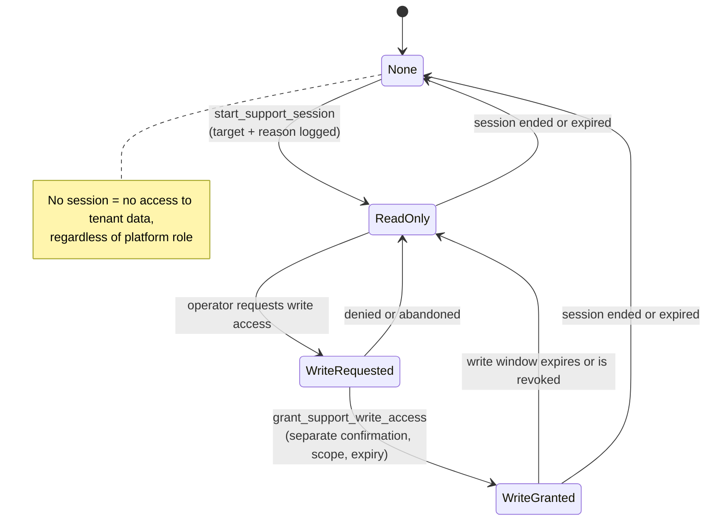

# VenuBoard — Roles and Permissions

**Status:** Complete and accepted 2026-08-30 · **Stage:** Pre-scaffold documentation · **Last updated:** 2026-08-31

This document is the authoritative definition of **who may do what** in VenuBoard. It is the source of truth for the `can(actor, action, scope)` primitive described in [architecture.md](./architecture.md#6-request-lifecycle-and-authorisation) and for the automated permission tests. How each conditional cell is enforced in PostgreSQL vs the future `can()` layer is recorded in [conditional-permission-enforcement.md](./security/conditional-permission-enforcement.md).

The action-based model and the **complete 33-action catalogue** were accepted on 2026-08-30 ([ADR-007](./decisions-and-open-questions.md#adr-007--action-based-permissions-with-fixed-mvp-roles)), the last of them — `moderate_content` — by [ADR-036](./decisions-and-open-questions.md#adr-036--moderate_content-as-a-platform-action). The support-access model this document depends on is also accepted ([ADR-022](./decisions-and-open-questions.md#adr-022--support-access-is-read-only-by-default-and-session-gated)). **Nothing in this document is pending approval**, so the permission test suite can be generated from it directly.

Related: [product-brief.md](./product-brief.md) · [data-model.md](./data-model.md) · [decisions-and-open-questions.md](./decisions-and-open-questions.md)

---

## 1. Model and enforcement

### 1.1 Action-based, not name-based

Authorisation is **never** decided by comparing role names in feature code. Every protected operation declares a **named action** and a **scope**, and the policy layer answers a single question:

```
can(actor, action, scope) -> boolean
```

- **actor** — the authenticated user plus their platform role (if any), business memberships, venue memberships, account status, and active support session (if any).
- **action** — one entry from the [action catalogue](#3-action-catalogue).
- **scope** — `platform`, `business:{id}`, `venue:{id}`, or `self`.

Roles exist only as a convenient bundle of actions. Adding a capability means adding an action to the catalogue and a row to the matrix — never a new `if (role === ...)` branch.

### 1.2 Scope rules

- A **business-scoped** grant applies to the business and, by inheritance, to **all venues in that business**.
- A **venue-scoped** grant applies to that venue only and never to sibling venues.
- A user may hold **different roles in different businesses and venues** simultaneously. Permissions are evaluated against the scope of the request, not globally.
- Where a user has multiple applicable memberships, the **most permissive** applicable grant wins within that scope.
- **Platform roles are a separate axis.** A platform role grants nothing at business or venue level, and no business or venue role can ever produce platform access. Platform access to *tenant data* additionally requires an active support session (see [section 7](#7-platform-support-and-impersonation)).

### 1.3 Enforcement layers

Every action is checked in the application **and** constrained by PostgreSQL Row Level Security, constraints and triggers. See [architecture.md](./architecture.md#7-tenant-isolation) and [conditional-permission-enforcement.md](./security/conditional-permission-enforcement.md).

`can()` improves UX and fails early. **It is not the security boundary** for anyone who can call the Data API. Tenant isolation, private-data access, entitlements, platform authority, moderation quarantine, deactivation and privilege escalation are enforced in the database. Conditional matrix cells default to **deny** at RLS until the condition can be checked against data that exists.

### 1.4 MVP roles are fixed

Fully custom roles are a non-goal for the first release. The role set below is fixed; per-venue *settings* (for example "staff posts require approval") provide the limited flexibility that MVP needs.

## 2. Role catalogue

### 2.1 Platform roles

| Role | Key | Who | Purpose |
| --- | --- | --- | --- |
| Platform administrator | `platform_admin` | VenuBoard operator | Full platform operations: creating businesses, venues and first owners, plans, subscriptions, trials, entitlements, quotas, domains, content classification enforcement, content takedown, audit review, support-session governance |
| Platform support | `platform_support` | Authorised support accounts | Diagnose customer problems. **Read-only by default**; any write requires a separately confirmed, time-limited, scoped support session |

**MFA is mandatory for both platform roles before production launch**, and must be supported architecturally from the first build ([ADR-013](./decisions-and-open-questions.md#adr-013--email-password-and-magic-link-authentication-with-mfa-support)). Enrolment and recovery mechanics are undecided (OQ-40). Because there is no public signup, these accounts are also the only way any tenant comes into existence, which makes their compromise the platform's worst single failure.

### 2.2 Business and venue roles

| Role | Key | Default scope | Purpose |
| --- | --- | --- | --- |
| Business owner | `business_owner` | Business (inherits all its venues) | The customer's accountable owner: manages the business, its venues, branding, people, billing state visibility, and all content |
| Venue manager | `venue_manager` | One or more venues | Runs a venue day to day: branding, content, staff presence, bookings, module visibility, venue analytics |
| Content editor | `content_editor` | Venue | Creates and (subject to the venue's approval setting) publishes feed posts, events and offers |
| Booking manager | `booking_manager` | Venue | Handles booking requests end to end, including customer contact details |
| Staff | `staff` | One or more venues | Maintains their own public profile and presence; may submit content for approval |

Notes:

- A **venue manager** may be granted several venues; each grant is a separate venue membership.
- **Staff** may work at multiple venues; their presence state is per venue.
- A user may be, for example, `business_owner` of Business A and `staff` at a venue of Business B.

## 3. Action catalogue

This catalogue is **accepted and final for the MVP at 33 actions**. Every entry carries equal weight; the earlier `(added)` provisional labels have been removed now that the catalogue is agreed. **The permissions matrix in [section 4](#4-permissions-matrix) has exactly 33 rows — one per action, no action missing and none invented.** The matrix groups related actions for readability, so its row order differs from this table's; the two sets are identical.

**Provenance.** The original product requirements named 18 actions. Fourteen more were added during design to close gaps the required list left open, and all fourteen are accepted: `view_booking_customer_details`, `manage_atmosphere`, `manage_offers`, `manage_own_public_profile`, `toggle_own_presence`, `manage_own_consent`, `submit_content_for_approval`, `manage_venue_domains`, `manage_notification_preferences`, `view_audit_log`, `manage_platform_tenants`, `start_support_session`, `grant_support_write_access`, `manage_platform_users`. That gave 32. A fifteenth addition, `moderate_content`, closed the last gap — platform moderation was described in the architecture and data model but had no action — and was approved as [ADR-036](./decisions-and-open-questions.md#adr-036--moderate_content-as-a-platform-action), bringing the catalogue to **33**. The full audit trail is in [decisions-and-open-questions.md](./decisions-and-open-questions.md#6-decision-history).

| Action | Scope | Meaning |
| --- | --- | --- |
| `manage_business` | business | Create/edit business details, create venues, archive venues |
| `manage_venue` | venue | Edit venue profile: details, address, hours, contact, navigation and homepage order, custom text, timezone |
| `manage_branding` | venue | Logo, brand colours, approved fonts, background image, theme |
| `invite_users` | business / venue | Send invitations into a scope |
| `assign_roles` | business / venue | Grant, change or remove memberships and roles |
| `view_private_staff_data` | venue | View legal name, email, phone, invitation state, internal notes, account status, employment information |
| `manage_public_staff_profiles` | venue | Edit public display name, avatar, bio, ordering, public heading, and their translations |
| `toggle_staff_presence` | venue | Set "in today" / "not in" for staff at the venue |
| `create_content` | venue | Create/edit drafts: feed posts, events, offers, including their translation rows |
| `approve_content` | venue | Approve or reject submissions awaiting approval |
| `publish_content` | venue | Move content to published, unpublish, archive |
| `manage_events` | venue | Full event management including scheduling, cancellation and cross-venue promotion/copy |
| `view_bookings` | venue | See booking requests **excluding** restricted customer contact details unless also permitted by `view_booking_customer_details` |
| `manage_bookings` | venue | Accept, decline, note, assign, reassign booking requests |
| `view_analytics` | business / venue | View analytics dashboards for the scope |
| `export_data` | business / venue | Export venue or business data (content, translations, bookings, customer lists, analytics) |
| `manage_venue_module_visibility` | venue | Enable/disable and publicly show/hide **entitled** modules |
| `manage_platform_entitlements` | platform | Grant/revoke plans, add-ons, trials, per-venue overrides, storage quotas, entitlement windows |
| `view_booking_customer_details` | venue | See a booking's customer contact details — separates "see the queue" from "see personal data" |
| `manage_atmosphere` | venue | Set the atmosphere status, custom wording and expiry period |
| `manage_offers` | venue | Manage offers and promotions and their validity |
| `manage_own_public_profile` | self | Edit **own** public display name, avatar, bio |
| `toggle_own_presence` | self | Toggle **own** presence at a venue where one holds membership and has consented — the fast one-tap path |
| `manage_own_consent` | self | Give or withdraw consent to public display of own profile and availability |
| `submit_content_for_approval` | venue | Submit a draft into `pending_approval` |
| `manage_venue_domains` | venue | Request/record a custom domain (verification remains a platform action) |
| `manage_notification_preferences` | self / venue | Own preferences; venue-level defaults where scope is venue |
| `view_audit_log` | business / venue / platform | Read audit entries within scope |
| `manage_platform_tenants` | platform | Create businesses, their first owner and their venues; suspend or cancel them; set subscription state; force content classification. **The only route by which a tenant can exist**, since there is no public signup |
| `start_support_session` | platform | Open a read-only support session into a tenant |
| `grant_support_write_access` | platform | Confirm time-limited, scoped write access within a support session |
| `manage_platform_users` | platform | Manage platform administrator and support accounts, including MFA enforcement |
| `moderate_content` | platform | Unpublish or quarantine tenant content and media that breaches the acceptable-use rules, independently of the venue's own publishing decisions. **Destructive only** — it can never create, edit or publish. Rules in [section 4.1](#41-moderate_content-rules) |

## 4. Permissions matrix

**Legend:** ✅ allowed · ⚠️ conditional (see [section 5](#5-conditional-rules)) · ⛔ not allowed · **RO** read-only

Platform columns describe capability **subject to the support-session rules in [section 7](#7-platform-support-and-impersonation)**. A ⚠️ in a platform column almost always means "only inside an active support session, audited" — see C10, C11 and C19. `platform_support` never gains write access to tenant data without a separately confirmed, time-limited, scoped session.

| Action | Platform admin | Platform support | Business owner | Venue manager | Content editor | Booking manager | Staff |
| --- | :--: | :--: | :--: | :--: | :--: | :--: | :--: |
| `manage_business` | ⚠️ | ⛔ | ✅ | ⛔ | ⛔ | ⛔ | ⛔ |
| `manage_venue` | ⚠️ | ⛔ | ✅ | ✅ | ⛔ | ⛔ | ⛔ |
| `manage_branding` | ⚠️ | ⛔ | ✅ | ✅ | ⛔ | ⛔ | ⛔ |
| `invite_users` | ⚠️ | ⛔ | ✅ | ⚠️ | ⛔ | ⛔ | ⛔ |
| `assign_roles` | ⚠️ | ⛔ | ✅ | ⚠️ | ⛔ | ⛔ | ⛔ |
| `view_private_staff_data` | ⚠️ | ⚠️ **RO** | ✅ | ✅ | ⛔ | ⛔ | ⛔ |
| `manage_public_staff_profiles` | ⚠️ | ⛔ | ✅ | ✅ | ⛔ | ⛔ | ⛔ |
| `toggle_staff_presence` | ⛔ | ⛔ | ✅ | ✅ | ⛔ | ⛔ | ⚠️ |
| `create_content` | ⛔ | ⛔ | ✅ | ✅ | ✅ | ⛔ | ⚠️ |
| `submit_content_for_approval` | ⛔ | ⛔ | ✅ | ✅ | ✅ | ⛔ | ✅ |
| `approve_content` | ⛔ | ⛔ | ✅ | ✅ | ⛔ | ⛔ | ⛔ |
| `publish_content` | ⛔ | ⛔ | ✅ | ✅ | ⚠️ | ⛔ | ⛔ |
| `manage_events` | ⛔ | ⛔ | ✅ | ✅ | ⚠️ | ⛔ | ⛔ |
| `manage_offers` | ⛔ | ⛔ | ✅ | ✅ | ⚠️ | ⛔ | ⛔ |
| `manage_atmosphere` | ⛔ | ⛔ | ✅ | ✅ | ⚠️ | ⛔ | ⚠️ |
| `view_bookings` | ⚠️ **RO** | ⚠️ **RO** | ✅ | ✅ | ⛔ | ✅ | ⛔ |
| `view_booking_customer_details` | ⚠️ | ⚠️ **RO** | ✅ | ✅ | ⛔ | ✅ | ⛔ |
| `manage_bookings` | ⛔ | ⛔ | ✅ | ✅ | ⛔ | ✅ | ⛔ |
| `view_analytics` | ⚠️ | ⚠️ **RO** | ✅ | ⚠️ | ⛔ | ⚠️ | ⛔ |
| `export_data` | ⚠️ | ⛔ | ✅ | ⚠️ | ⛔ | ⚠️ | ⛔ |
| `manage_venue_module_visibility` | ⛔ | ⛔ | ✅ | ✅ | ⛔ | ⛔ | ⛔ |
| `manage_venue_domains` | ✅ | ⛔ | ✅ | ⚠️ | ⛔ | ⛔ | ⛔ |
| `manage_platform_entitlements` | ✅ | ⛔ | ⛔ | ⛔ | ⛔ | ⛔ | ⛔ |
| `manage_platform_tenants` | ✅ | ⛔ | ⛔ | ⛔ | ⛔ | ⛔ | ⛔ |
| `manage_platform_users` | ✅ | ⛔ | ⛔ | ⛔ | ⛔ | ⛔ | ⛔ |
| `moderate_content` | ✅ | ⛔ | ⛔ | ⛔ | ⛔ | ⛔ | ⛔ |
| `start_support_session` | ✅ | ✅ | ⛔ | ⛔ | ⛔ | ⛔ | ⛔ |
| `grant_support_write_access` | ✅ | ⛔ | ⛔ | ⛔ | ⛔ | ⛔ | ⛔ |
| `view_audit_log` | ✅ | ✅ **RO** | ⚠️ | ⚠️ | ⛔ | ⛔ | ⛔ |
| `manage_own_public_profile` | ⛔ | ⛔ | ✅ | ✅ | ✅ | ✅ | ✅ |
| `toggle_own_presence` | ⛔ | ⛔ | ⚠️ | ⚠️ | ⚠️ | ⚠️ | ✅ |
| `manage_own_consent` | ⛔ | ⛔ | ✅ | ✅ | ✅ | ✅ | ✅ |
| `manage_notification_preferences` | ✅ | ⛔ | ✅ | ✅ | ✅ | ✅ | ✅ |

Reading notes:

- ⛔ in a platform column for content actions is deliberate: **the operator does not author customer content.** Content writes by the operator are only possible inside a granted support-write session, and are audited as support actions rather than being an ordinary capability.
- `moderate_content` is the deliberate exception: it lets the operator take prohibited content **down** without a support session, because a takedown may be urgent and is never an act of authoring. Full rules in [section 4.1](#41-moderate_content-rules).
- `manage_own_*` and `toggle_own_presence` are `self`-scoped and apply to any user who has a venue membership; platform roles have no self-scoped venue profile.

### 4.1 `moderate_content` rules

Accepted as [ADR-036](./decisions-and-open-questions.md#adr-036--moderate_content-as-a-platform-action). This action is the operator's legal and reputational safety valve, so its limits matter as much as its power.

**Who holds it**

- It is a **platform action**. `platform_admin` holds it.
- **`platform_support` does not receive it by default.** Support triages and escalates; it does not take content down.
- **No dedicated moderator role exists in the MVP.** A separate moderator role is a deliberate non-goal — see [section 11](#11-deliberately-not-in-mvp).

**What it can do**

- **Quarantine or unpublish** public content and media that breaches the acceptable-use rules in [product-brief.md](./product-brief.md#11-adult-content-classification).
- It works **without an active tenant support session**, unlike every other platform capability over tenant data. A takedown may be urgent, and it exposes nothing that loading the public page would not.

**What it cannot do**

- It **cannot create content, rewrite content, publish content, or act as a venue author.** There is no path from moderation to authoring. Restoring content that the operator quarantined is not authoring, and is itself audited.
- It does not confer read access to private tenant data. Reading anything beyond the offending resource still requires a support session (C10, C11).

**Mandatory conditions**

- **Every moderation action requires a reason.** An action submitted without a stated reason is rejected — not warned about, rejected.
- Every action records the **acting platform user, the venue, the affected resource, the previous state, the resulting state, the reason and the timestamp**.
- The action **preserves the original content and any associated evidence** unless deletion is legally required, so a later dispute, appeal or legal request can still be answered.
- **Restoring quarantined content is audited to the same standard**, with its own reason.
- **A venue cannot bypass a quarantine by republishing the same record.** Quarantine is a precondition of publication enforced in the database, not merely a hidden button in the interface — see [data-model.md](./data-model.md#69-platform-moderation-and-quarantine).
- The venue is notified of the action, and the platform audit entry is retained regardless of the venue's own retention settings.

## 5. Conditional rules

Each conditional cell resolves through an explicit, testable rule.

| # | Condition | Rule |
| --- | --- | --- |
| C1 | `invite_users` — venue manager | Allowed **only if** the business owner has enabled "venue managers may invite users" for that venue. Even then, a venue manager may only invite into **their own venue(s)** and only with roles at or below `venue_manager` (never `business_owner`). |
| C2 | `assign_roles` — venue manager | Allowed **only** for venue-scoped memberships in venues they manage, and only for roles at or below `venue_manager`. Never business-scoped. Never self-promotion. |
| C3 | `toggle_staff_presence` — staff | A staff member may toggle **their own** presence at a venue where they hold an active membership and have consented. They may not toggle another person's presence. |
| C4 | `create_content` — staff | Staff may create drafts and submit them; whether their content can go live depends on `publish_content`, which staff never hold. If the venue's "staff submissions require approval" setting is on (default), submissions enter `pending_approval`. |
| C5 | `publish_content`, `manage_events`, `manage_offers` — content editor | Allowed by default. If the venue enables "all content requires manager approval", the content editor's submissions enter `pending_approval` instead of publishing, and the effective answer becomes ⛔ for direct publishing. |
| C6 | `manage_atmosphere` — content editor / staff | Off by default. A venue may opt in to "staff may update atmosphere" so front-of-house can keep it fresh; otherwise manager and owner only. |
| C7 | `view_analytics` — venue manager | Allowed for venues they manage only. Business-level aggregate analytics require `business_owner` or platform. |
| C8 | `view_analytics` — booking manager | Limited to booking-related metrics for their venue(s) (requests, accepted, conversion, response time). No branding, feed, or business-wide metrics. |
| C9 | `export_data` — venue manager / booking manager | Venue manager: allowed for their venues, excluding business-level exports. Booking manager: booking data for their venues only. Exports containing personal data are always audited. |
| C10 | `export_data` — platform admin | Only for legitimate operational reasons (customer-requested export, migration, legally required disclosure), within a support session, fully audited. Not an ordinary browsing capability. |
| C11 | `view_private_staff_data` / `view_booking_customer_details` — platform | Only inside an active support session, with a stated reason, audited per access. Read-only unless write access has been separately granted. Values may be **masked by default** with an explicit, audited reveal action (masking-by-default is proposed; confirmation is OPEN). |
| C12 | `manage_venue_domains` — venue manager | May *record/request* a custom domain for their venue; **verification and activation remain a platform action** because DNS/TLS is manual in MVP. |
| C13 | `view_audit_log` — business owner / venue manager | Business owner sees audit entries for their business and venues; venue manager sees entries for their venues. Neither sees platform-internal entries. Exact tenant-visible field set is OPEN. |
| C14 | `toggle_own_presence` — non-staff roles | Available to any user who has an active venue membership **and** a public staff profile **and** has consented. An owner or manager who does not appear publicly has nothing to toggle. |
| C15 | Account status gate | All grants above require the actor's account to be `active`. `pending`, `suspended` and `deactivated` accounts hold no effective permissions (a `pending` user may only accept their invitation). |
| C16 | Subscription state gate | In `restricted`, content and configuration writes are blocked regardless of role, while the public site stays live and reads and exports continue. In `suspended`, all tenant writes are blocked and the public site is taken down; reads and exports remain so a customer can always retrieve their data. See [product-brief.md](./product-brief.md#13-subscription-lifecycle). |
| C17 | Entitlement gate | Any module action requires the module to be **entitled**. `manage_venue_module_visibility` can only toggle modules that are already entitled — it can never create an entitlement. |
| C18 | Cross-venue actions | Copying or promoting an event across venues requires the actor to be authorised **in both** the source and destination venue, and both venues must belong to the same business. |
| C19 | Platform admin writes inside a tenant | A platform administrator may perform tenant-scoped writes (`manage_business`, `manage_venue`, `manage_branding`, `invite_users`, `assign_roles`, `manage_public_staff_profiles`) **only inside an active support session with write access granted** (see [section 7](#7-platform-support-and-impersonation)), with a stated reason, and every write audited as a support action. Purely platform-level actions (`manage_platform_tenants`, `manage_platform_entitlements`, `manage_platform_users`, `manage_venue_domains` verification) need no support session because they operate on platform records, not on tenant content. Similarly, platform-wide aggregate analytics need no session; reading an individual venue's analytics does. **`moderate_content` is explicitly excluded from this rule** and needs no session, because it can only remove public content and never authors anything ([section 4.1](#41-moderate_content-rules)). |

## 6. Invitations and role assignment

- Onboarding is **invitation-based**. An invitation carries: target scope (business or venue), the role to be granted, the invited email address, the inviter's identity, an expiry, and a single-use token.
- **There is no public self-service signup in the MVP.** Businesses, their venues and the **first business owner** are created by the platform operator via `manage_platform_tenants` ([ADR-033](./decisions-and-open-questions.md#adr-033--operator-led-onboarding-no-self-service-signup-in-the-mvp)). Every other user arrives by invitation from inside the tenant.
- **Business owners may invite managers** and any lower role, into their business or any of its venues.
- **Venue managers may invite users only where explicitly allowed** (C1), only into their own venues, and only at or below their own level.
- **Nobody may grant a role higher than their own**, and nobody may grant themselves a role.
- Removing the **last** active business owner from a business is blocked; ownership must be transferred first.
- Accepting an invitation creates a membership and moves the account from `pending` to `active`. The invitee sets a password, requests a magic link, or does both — **both sign-in methods are supported** ([ADR-013](./decisions-and-open-questions.md#adr-013--email-password-and-magic-link-authentication-with-mfa-support)).
- Invitation issue, acceptance, expiry, revocation and every role change are audited.

## 7. Platform support and impersonation

The support model exists so the operator can genuinely help customers **without** creating a silent back door.

### 7.1 Policy

1. **Read-only by default.** A support session begins read-only. `platform_support` cannot write tenant data at all without a grant.
2. **Explicit, labelled sessions.** The operator must open a support session naming the target tenant and a **reason** (and, where applicable, a support ticket reference). No open session means no access to tenant data.
3. **Write access is separate, confirmed, time-limited and scoped.** Temporary write access requires a distinct confirmation step, has an expiry, and is limited to the specific venue or business — never platform-wide.
4. **Never reveals secrets.** A support session never exposes passwords, password hashes, session tokens, magic-link or password-reset tokens, MFA factors or recovery codes, or any other authentication secret. There is no mechanism to "become" a user by borrowing their credentials.
5. **Fully audited.** Session start, session end, the impersonated/target identity, the stated reason, every write action, and read actions where practical are all recorded in an append-only audit log.
6. **Prominently visible.** While a support session is active, a persistent, unmistakable banner is shown, stating the target tenant, the mode (read-only or write), who is acting, and the time remaining.
7. **Does not bypass tenant boundaries silently.** The session grants scoped, explicit, logged access. Tenant isolation is not disabled; it is narrowed to the approved target.
8. **Auto-expiry.** Sessions expire automatically (default duration OPEN) and can be ended manually at any time. Expiry immediately revokes access.
9. **Customer transparency.** Whether and how customers are notified of support sessions is OPEN (proposed: business owners can see support-session entries in their own audit view — see C13).

**One deliberate exception: `moderate_content`.** Taking prohibited public content down does not require a support session, because it may be legally urgent, it reveals nothing beyond the public page, and it can only remove — never read private data, never write content. It carries its own stricter conditions instead: platform administrators only, a mandatory reason, a full audit entry for both takedown and restore, and preservation of the original content as evidence. See [section 4.1](#41-moderate_content-rules). Everything else the operator does inside a tenant goes through the session model above.

### 7.2 Support session lifecycle



## 8. Public and private data access

Public staff data and private employment/account data are **stored separately** (see [data-model.md](./data-model.md#51-staff-public-and-private-separation)) and governed by different actions.

| Data | Stored in | Who may read |
| --- | --- | --- |
| Public display name, public photo, public bio, current public presence state | Public staff profile / presence | Anyone (subject to consent, module entitlement + enablement, and venue publication) |
| Legal name, email, telephone, invitation state, internal notes, account status, employment information | Private staff record | `view_private_staff_data` holders in that venue; platform only within a support session (C11) |
| Booking customer contact details | Booking request (restricted fields) | `view_booking_customer_details` holders in that venue; platform only within a support session (C11) |
| Internal booking notes | Booking request | `view_bookings` holders in that venue — never public |

Additional rules:

- **Consent is required** before a staff member's public profile or presence appears publicly. Consent is recorded with a timestamp and is **revocable at any time** by the staff member (`manage_own_consent`).
- Withdrawing consent removes the person from public display **immediately** and does not delete their account, history or attribution.
- A public read path must never be able to reach a private table. This is asserted by the tenant-isolation and public-read test suites.
- Analytics must not re-identify individuals; staff-profile metrics are aggregate and only for consenting staff.

## 9. Account lifecycle and reassignment

| State | Meaning | Effective permissions |
| --- | --- | --- |
| `pending` | Invited, not yet accepted | None except accepting the invitation |
| `active` | Normal | Per matrix |
| `suspended` | Temporarily blocked (security or administrative) | None; sessions revoked |
| `deactivated` | Left the venue/business | None; historical records preserved and still attributed |

Authentication for all of these accounts is **email with either a password or a magic link**, chosen at each sign-in. MFA is available to any user and **mandatory for platform accounts before production launch**.

Rules:

- **Deactivation, not destructive deletion.** Content, bookings and status history remain intact and attributed after someone leaves.
- **Reassignment is mandatory on deactivation.** Open booking requests assigned to that person, and any pending content awaiting their action, must be reassigned to an authorised user before deactivation completes. Deactivation is blocked until this is done (or the actor explicitly reassigns to themselves).
- **Public removal is immediate** on deactivation: the person disappears from public staff display and presence regardless of consent state.
- **Restoration** reactivates the membership and reconnects history; consent must be re-confirmed rather than assumed.
- **Deletion of a person's personal data** on request is handled through the retention/erasure policy, not through ordinary deactivation. The legal shape of this is OPEN.
- Every state change, reassignment and restoration is audited.

## 10. Audit expectations

Audited at minimum:

- Tenant creation by the operator: a new business, its first owner and its venues.
- Membership and role changes; invitation issue, acceptance, revocation, expiry.
- Entitlement, plan, add-on, trial, trial extension, override, quota and subscription-state changes, per venue.
- Support-session start/end, mode changes, write grants, and actions taken within a session.
- Consent given or withdrawn.
- Account suspension, deactivation, restoration, and reassignment of work; MFA enrolment and reset for platform accounts.
- Publishing and unpublishing of public content.
- Every `moderate_content` action — quarantine, unpublish **and restore** — recording the acting platform user, venue, affected resource, previous state, resulting state, **mandatory reason** and timestamp ([section 4.1](#41-moderate_content-rules)).
- Access to restricted personal data where practical (private staff data, booking customer details), and every data export.
- Custom-domain and content-classification changes.

Audit entries are append-only and record: actor, effective identity (including support context), action, scope, target record, timestamp, outcome, and the **environment** that produced them. They never contain passwords, tokens or other secrets.

## 11. Deliberately not in MVP

- Fully custom roles and per-permission role builders.
- Per-field or per-record ACLs beyond the public/private separation described here.
- Approval workflows more elaborate than the single `pending_approval` step.
- Delegated platform roles for resellers or agencies.
- **Dedicated content-moderator roles.** Moderation authority stays with `platform_admin` ([ADR-036](./decisions-and-open-questions.md#adr-036--moderate_content-as-a-platform-action)).
- Customer-configurable audit retention.
- A public self-service signup path; tenants are created by the operator ([ADR-033](./decisions-and-open-questions.md#adr-033--operator-led-onboarding-no-self-service-signup-in-the-mvp)).

## 12. Test obligations

Derived directly from this document, and run against the **fixed test identities** — one account per role — from the deterministic seed dataset ([ADR-035](./decisions-and-open-questions.md#adr-035--deterministic-repeatable-seed-data-and-fixed-test-identities)), so every assertion maps to a real login against known data:

1. Every cell in [section 4](#4-permissions-matrix) has a positive and a negative test.
2. Every conditional rule in [section 5](#5-conditional-rules) has tests for both branches.
3. Cross-tenant attempts fail for every role at both application and RLS level, translation tables included.
4. Public read paths cannot reach private tables or unpublished content, and cannot read a translation whose parent is not publicly visible.
5. Support sessions cannot write without a grant, expire correctly, and always produce audit entries.
6. Deactivation is blocked while assigned bookings remain unassigned.
7. Both sign-in methods reach the same authorisation outcome, and a platform account without MFA is refused once enforcement is enabled.
8. A venue's subscription state gates only that venue: a suspended venue never affects a sibling in the same business.
9. `moderate_content` is rejected without a reason, is refused to `platform_support`, cannot create or edit content, and writes a complete audit entry for both quarantine and restore.
10. A venue user **cannot** republish, unarchive or otherwise re-expose a platform-quarantined record; the attempt is rejected by the database, not only by the interface.
11. A translation or other tenant-keyed child row **cannot** be written with a `venue_id` that differs from its parent's; the attempt is rejected by a database constraint ([ADR-037](./decisions-and-open-questions.md#adr-037--duplicated-tenant-keys-are-protected-by-composite-foreign-keys)).

Test credentials come from environment variables or secure test configuration and are **never committed**. Suites never run against production data.
